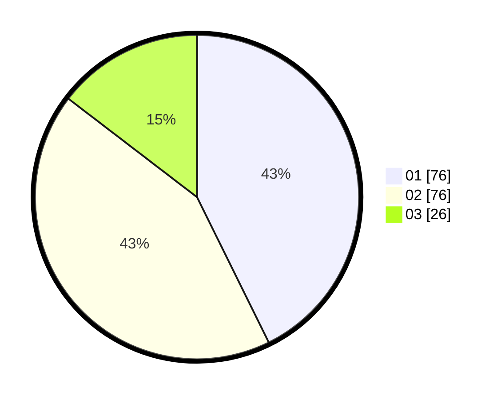

# Hasil

Hasil perolehan suara paslon dapat dilihat pada file paslon-01.txt, paslon-02.txt, dan paslon-03.txt.

Jika tidak ada, artinya data tersebut belum ada pada SIREKAP.

## Perolehan Suara

 * Paslon 01: **76**.
 * Paslon 02: **76**.
 * Paslon 03: **26**.

## Foto C Plano

https://sirekap-obj-formc.kpu.go.id/9e26/pemilu/ppwp/31/74/06/10/02/3174061002101-20240214-235710--433632cf-d5e1-4986-b75d-26aa8d903426.jpg

https://sirekap-obj-formc.kpu.go.id/9e26/pemilu/ppwp/31/74/06/10/02/3174061002101-20240214-235712--6871fffa-0534-4a22-8c39-268eef99223d.jpg

https://sirekap-obj-formc.kpu.go.id/9e26/pemilu/ppwp/31/74/06/10/02/3174061002101-20240214-235713--a84bc239-8e86-4d17-b89c-1654345eda0e.jpg
