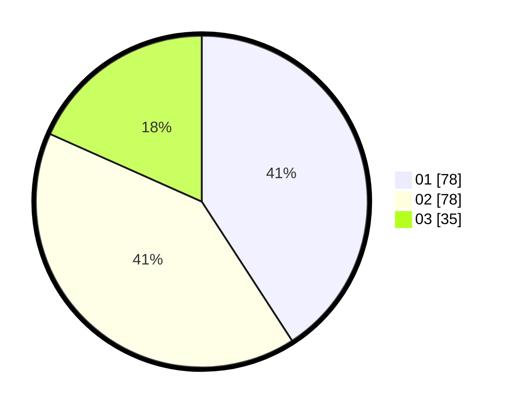

# Hasil

Hasil perolehan suara paslon dapat dilihat pada file paslon-01.txt, paslon-02.txt, dan paslon-03.txt.

Jika tidak ada, artinya data tersebut belum ada pada SIREKAP.

## Perolehan Suara

 * Paslon 01: **78**.
 * Paslon 02: **78**.
 * Paslon 03: **35**.

## Foto C Plano

https://sirekap-obj-formc.kpu.go.id/dd08/pemilu/ppwp/31/74/06/10/02/3174061002110-20240217-111210--46dd877f-3c4b-4c39-846b-60f6c150b0a7.jpg

https://sirekap-obj-formc.kpu.go.id/dd08/pemilu/ppwp/31/74/06/10/02/3174061002110-20240217-111317--22d3e933-6a5c-4cea-9001-6e7b75bb9e48.jpg

https://sirekap-obj-formc.kpu.go.id/dd08/pemilu/ppwp/31/74/06/10/02/3174061002110-20240217-111449--10b151d8-1fe0-4d38-bdfe-729264ffeff5.jpg

## DATA PEMILIH TETAP

Jumlah pemilih dalam DPT: **278**.
 * L: **137**.
 * P: **141**.

## DATA PENGGUNA HAK PILIH

Jumlah pengguna hak pilih dalam DPT: **195**.
 * L: **88**.
 * P: **108**.

Jumlah pengguna hak pilih dalam DPTb: **8**.
 * L: **0**.
 * P: **0**.

Jumlah pengguna hak pilih dalam DPK: **0**.
 * L: **0**.
 * P: **0**.

Jumlah pengguna hak pilih: **195**.
 * L: **88**.
 * P: **108**.

## JUMLAH SUARA SAH DAN TIDAK SAH

JUMLAH SELURUH SUARA SAH: **191**.

JUMLAH SUARA TIDAK SAH: **5**.

JUMLAH SELURUH SUARA SAH DAN SUARA TIDAK SAH: **196**.
