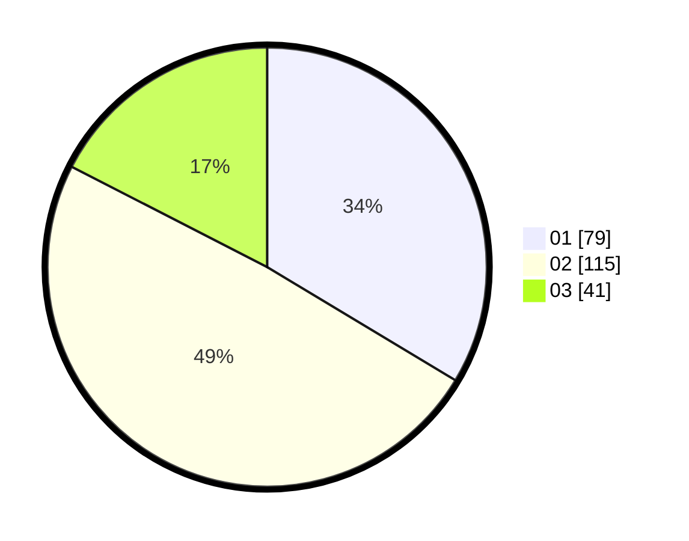

# Hasil

Hasil perolehan suara paslon dapat dilihat pada file paslon-01.txt, paslon-02.txt, dan paslon-03.txt.

Jika tidak ada, artinya data tersebut belum ada pada SIREKAP.

## Perolehan Suara

 * Paslon 01: **79**.
 * Paslon 02: **115**.
 * Paslon 03: **41**.

## Foto C Plano

https://sirekap-obj-formc.kpu.go.id/cb52/pemilu/ppwp/31/74/06/10/02/3174061002113-20240218-175026--047a9722-55fe-4072-b397-458b73c8f192.jpg

https://sirekap-obj-formc.kpu.go.id/cb52/pemilu/ppwp/31/74/06/10/02/3174061002113-20240218-175101--8e9520e1-a134-457d-9e36-a8918468afc9.jpg

https://sirekap-obj-formc.kpu.go.id/cb52/pemilu/ppwp/31/74/06/10/02/3174061002113-20240218-175129--84307bb5-e6a8-4b86-b943-96c152420da5.jpg

## DATA PEMILIH TETAP

Jumlah pemilih dalam DPT: **277**.
 * L: **127**.
 * P: **150**.

## DATA PENGGUNA HAK PILIH

Jumlah pengguna hak pilih dalam DPT: **231**.
 * L: **104**.
 * P: **127**.

Jumlah pengguna hak pilih dalam DPTb: **4**.
 * L: **2**.
 * P: **2**.

Jumlah pengguna hak pilih dalam DPK: **1**.
 * L: **1**.
 * P: **0**.

Jumlah pengguna hak pilih: **236**.
 * L: **107**.
 * P: **129**.

## JUMLAH SUARA SAH DAN TIDAK SAH

JUMLAH SELURUH SUARA SAH: **235**.

JUMLAH SUARA TIDAK SAH: **1**.

JUMLAH SELURUH SUARA SAH DAN SUARA TIDAK SAH: **236**.
