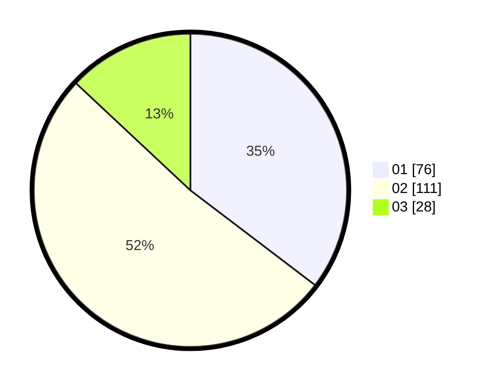

# Hasil

Hasil perolehan suara paslon dapat dilihat pada file paslon-01.txt, paslon-02.txt, dan paslon-03.txt.

Jika tidak ada, artinya data tersebut belum ada pada SIREKAP.

## Perolehan Suara

 * Paslon 01: **76**.
 * Paslon 02: **111**.
 * Paslon 03: **28**.

## Foto C Plano

https://sirekap-obj-formc.kpu.go.id/a8be/pemilu/ppwp/31/74/06/10/02/3174061002118-20240215-061215--1fca6f82-2d31-49c1-9b62-2ea600aca8fa.jpg

https://sirekap-obj-formc.kpu.go.id/a8be/pemilu/ppwp/31/74/06/10/02/3174061002118-20240214-155241--6d305186-c186-4e84-9adc-aa6f54e26a4e.jpg

https://sirekap-obj-formc.kpu.go.id/a8be/pemilu/ppwp/31/74/06/10/02/3174061002118-20240214-155248--fd6fb1ca-b5cb-42cb-8729-35894f65e26f.jpg

## DATA PEMILIH TETAP

Jumlah pemilih dalam DPT: **276**.
 * L: **141**.
 * P: **135**.

## DATA PENGGUNA HAK PILIH

Jumlah pengguna hak pilih dalam DPT: **217**.
 * L: **104**.
 * P: **113**.

Jumlah pengguna hak pilih dalam DPTb: **0**.
 * L: **0**.
 * P: **0**.

Jumlah pengguna hak pilih dalam DPK: **0**.
 * L: **0**.
 * P: **0**.

Jumlah pengguna hak pilih: **217**.
 * L: **104**.
 * P: **113**.

## JUMLAH SUARA SAH DAN TIDAK SAH

JUMLAH SELURUH SUARA SAH: **215**.

JUMLAH SUARA TIDAK SAH: **2**.

JUMLAH SELURUH SUARA SAH DAN SUARA TIDAK SAH: **217**.
