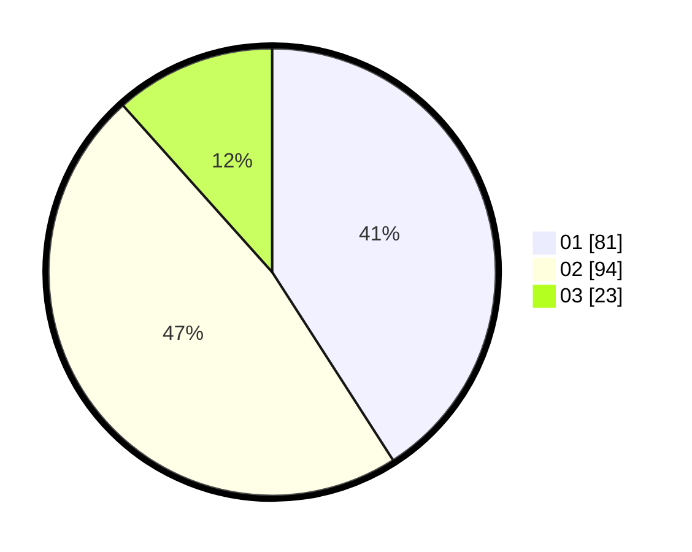

# Hasil

Hasil perolehan suara paslon dapat dilihat pada file paslon-01.txt, paslon-02.txt, dan paslon-03.txt.

Jika tidak ada, artinya data tersebut belum ada pada SIREKAP.

## Perolehan Suara

 * Paslon 01: **81**.
 * Paslon 02: **94**.
 * Paslon 03: **23**.

## Foto C Plano

https://sirekap-obj-formc.kpu.go.id/1d1c/pemilu/ppwp/31/74/06/10/02/3174061002121-20240218-161439--5b1d09d2-2a15-42cb-8cb8-f8512a49e2a8.jpg

https://sirekap-obj-formc.kpu.go.id/1d1c/pemilu/ppwp/31/74/06/10/02/3174061002121-20240218-161718--c7de2953-4e97-44df-bead-ed46eb15a0a1.jpg

https://sirekap-obj-formc.kpu.go.id/1d1c/pemilu/ppwp/31/74/06/10/02/3174061002121-20240218-161852--c43e7312-239b-474e-ad7c-5bac8f012575.jpg

## DATA PEMILIH TETAP

Jumlah pemilih dalam DPT: **231**.
 * L: **118**.
 * P: **113**.

## DATA PENGGUNA HAK PILIH

Jumlah pengguna hak pilih dalam DPT: **208**.
 * L: **103**.
 * P: **105**.

Jumlah pengguna hak pilih dalam DPTb: **0**.
 * L: **0**.
 * P: **0**.

Jumlah pengguna hak pilih dalam DPK: **0**.
 * L: **0**.
 * P: **0**.

Jumlah pengguna hak pilih: **208**.
 * L: **103**.
 * P: **105**.

## JUMLAH SUARA SAH DAN TIDAK SAH

JUMLAH SELURUH SUARA SAH: **208**.

JUMLAH SUARA TIDAK SAH: **0**.

JUMLAH SELURUH SUARA SAH DAN SUARA TIDAK SAH: **208**.
