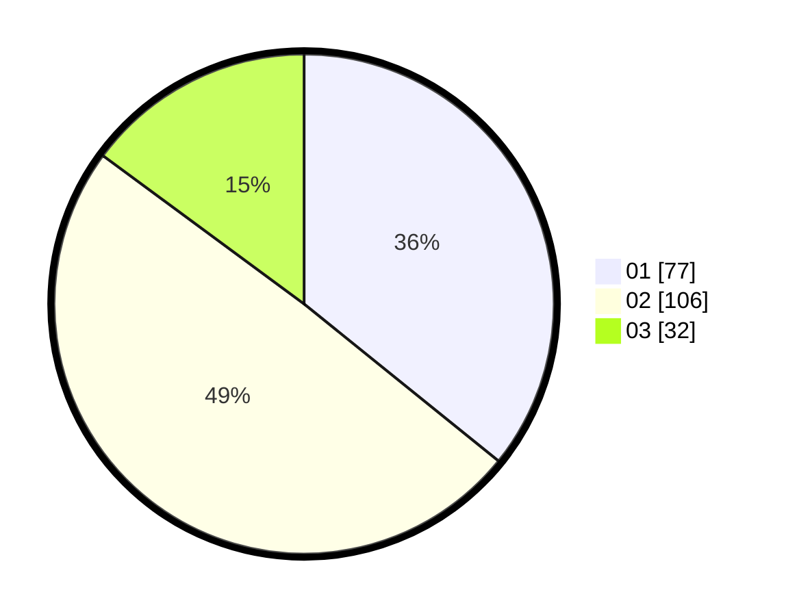

# Hasil

Hasil perolehan suara paslon dapat dilihat pada file paslon-01.txt, paslon-02.txt, dan paslon-03.txt.

Jika tidak ada, artinya data tersebut belum ada pada SIREKAP.

## Perolehan Suara

 * Paslon 01: **77**.
 * Paslon 02: **106**.
 * Paslon 03: **32**.

## Foto C Plano

https://sirekap-obj-formc.kpu.go.id/8763/pemilu/ppwp/31/74/06/10/02/3174061002125-20240214-200050--34ec90e7-e190-4909-813e-19d1fed0b63d.jpg

https://sirekap-obj-formc.kpu.go.id/8763/pemilu/ppwp/31/74/06/10/02/3174061002125-20240214-200058--ba22ea2d-93c2-4f05-b75e-1ac9247d1150.jpg

https://sirekap-obj-formc.kpu.go.id/8763/pemilu/ppwp/31/74/06/10/02/3174061002125-20240214-221036--843cf0ca-82f7-4639-9767-5c0eea4d2503.jpg
