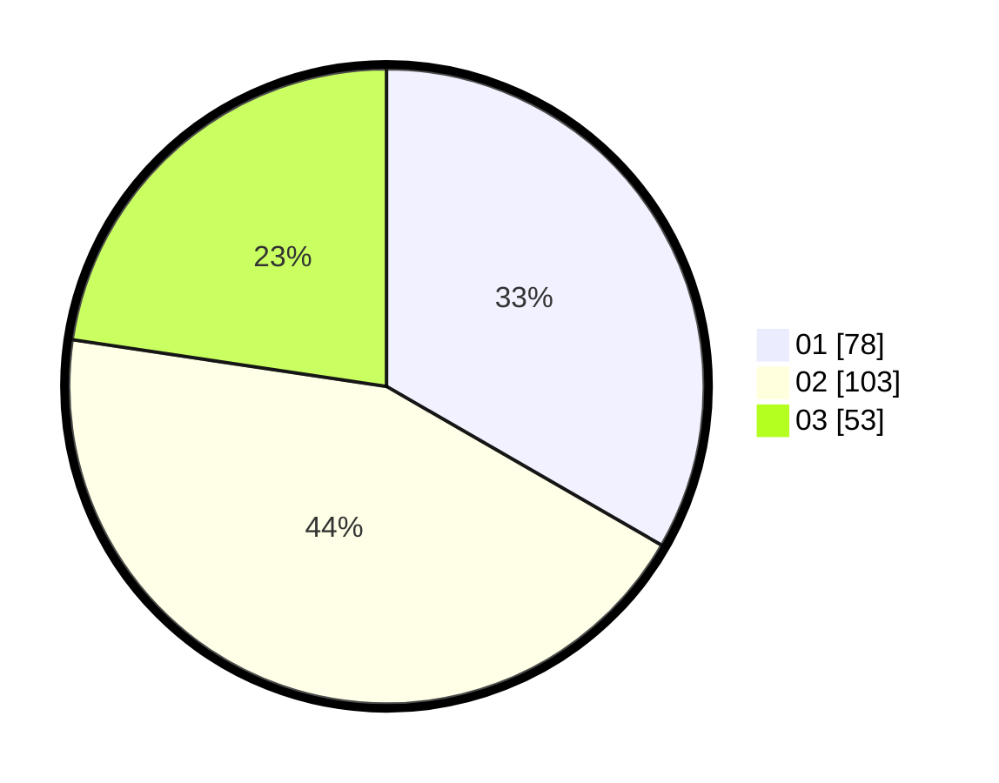

# Hasil

Hasil perolehan suara paslon dapat dilihat pada file paslon-01.txt, paslon-02.txt, dan paslon-03.txt.

Jika tidak ada, artinya data tersebut belum ada pada SIREKAP.

## Perolehan Suara

 * Paslon 01: **78**.
 * Paslon 02: **103**.
 * Paslon 03: **53**.

## Foto C Plano

https://sirekap-obj-formc.kpu.go.id/7dca/pemilu/ppwp/31/74/06/10/02/3174061002129-20240214-215245--e4b600fa-9b48-4552-99a4-30ab9302919b.jpg

https://sirekap-obj-formc.kpu.go.id/7dca/pemilu/ppwp/31/74/06/10/02/3174061002129-20240214-155337--312f85bc-5532-4e0f-b783-3745bf54578b.jpg

https://sirekap-obj-formc.kpu.go.id/7dca/pemilu/ppwp/31/74/06/10/02/3174061002129-20240214-215352--f93823ee-5d5d-4797-83b6-cd0b99021684.jpg
