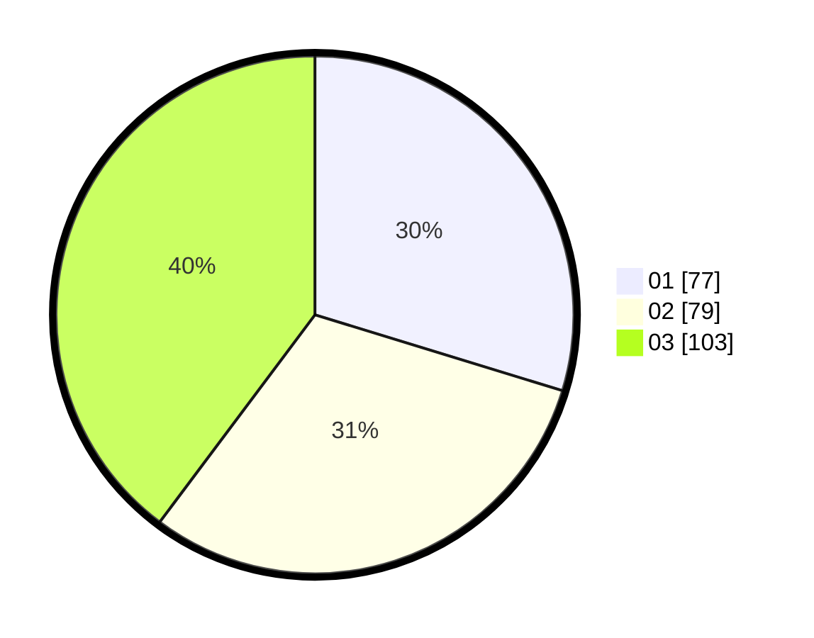

# Hasil

Hasil perolehan suara paslon dapat dilihat pada file paslon-01.txt, paslon-02.txt, dan paslon-03.txt.

Jika tidak ada, artinya data tersebut belum ada pada SIREKAP.

## Perolehan Suara

 * Paslon 01: **77**.
 * Paslon 02: **79**.
 * Paslon 03: **103**.

## Foto C Plano

https://sirekap-obj-formc.kpu.go.id/2422/pemilu/ppwp/31/74/06/10/02/3174061002132-20240217-114456--966dac0c-4ea4-40d4-b2a8-cb25cb9242b5.jpg

https://sirekap-obj-formc.kpu.go.id/2422/pemilu/ppwp/31/74/06/10/02/3174061002132-20240217-114600--51367798-dca0-457a-a1aa-fd46d82f47cf.jpg

https://sirekap-obj-formc.kpu.go.id/2422/pemilu/ppwp/31/74/06/10/02/3174061002132-20240217-114656--90ddb706-ebce-4803-a293-2afe4e3aec68.jpg

## DATA PEMILIH TETAP

Jumlah pemilih dalam DPT: **275**.
 * L: **125**.
 * P: **150**.

## DATA PENGGUNA HAK PILIH

Jumlah pengguna hak pilih dalam DPT: **233**.
 * L: **108**.
 * P: **125**.

Jumlah pengguna hak pilih dalam DPTb: **26**.
 * L: **7**.
 * P: **19**.

Jumlah pengguna hak pilih dalam DPK: **3**.
 * L: **2**.
 * P: **1**.

Jumlah pengguna hak pilih: **262**.
 * L: **117**.
 * P: **145**.

## JUMLAH SUARA SAH DAN TIDAK SAH

JUMLAH SELURUH SUARA SAH: **259**.

JUMLAH SUARA TIDAK SAH: **3**.

JUMLAH SELURUH SUARA SAH DAN SUARA TIDAK SAH: **262**.
