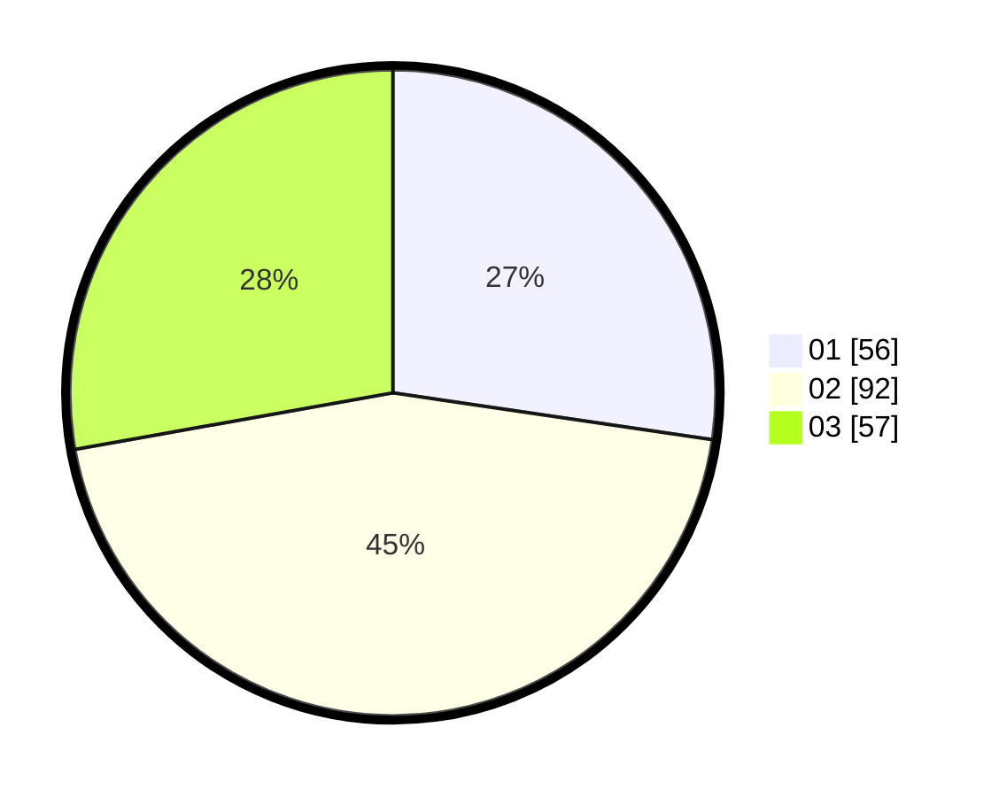

# Hasil

Hasil perolehan suara paslon dapat dilihat pada file paslon-01.txt, paslon-02.txt, dan paslon-03.txt.

Jika tidak ada, artinya data tersebut belum ada pada SIREKAP.

## Perolehan Suara

 * Paslon 01: **56**.
 * Paslon 02: **92**.
 * Paslon 03: **57**.

## Foto C Plano

https://sirekap-obj-formc.kpu.go.id/2bf1/pemilu/ppwp/31/74/06/10/03/3174061003002-20240214-210527--c9ea8dbf-674c-419d-9a47-ea9fa3a435b1.jpg

https://sirekap-obj-formc.kpu.go.id/2bf1/pemilu/ppwp/31/74/06/10/03/3174061003002-20240214-155918--cfe846d3-0f89-4a7c-af30-e1c6def8c1c1.jpg

https://sirekap-obj-formc.kpu.go.id/2bf1/pemilu/ppwp/31/74/06/10/03/3174061003002-20240214-160111--629b644b-1890-44e1-9443-c9030fdb19e2.jpg

## DATA PEMILIH TETAP

Jumlah pemilih dalam DPT: **243**.
 * L: **106**.
 * P: **137**.

## DATA PENGGUNA HAK PILIH

Jumlah pengguna hak pilih dalam DPT: **203**.
 * L: **91**.
 * P: **112**.

Jumlah pengguna hak pilih dalam DPTb: **10**.
 * L: **8**.
 * P: **2**.

Jumlah pengguna hak pilih dalam DPK: **3**.
 * L: **1**.
 * P: **2**.

Jumlah pengguna hak pilih: **216**.
 * L: **100**.
 * P: **116**.

## JUMLAH SUARA SAH DAN TIDAK SAH

JUMLAH SELURUH SUARA SAH: **205**.

JUMLAH SUARA TIDAK SAH: **11**.

JUMLAH SELURUH SUARA SAH DAN SUARA TIDAK SAH: **216**.
