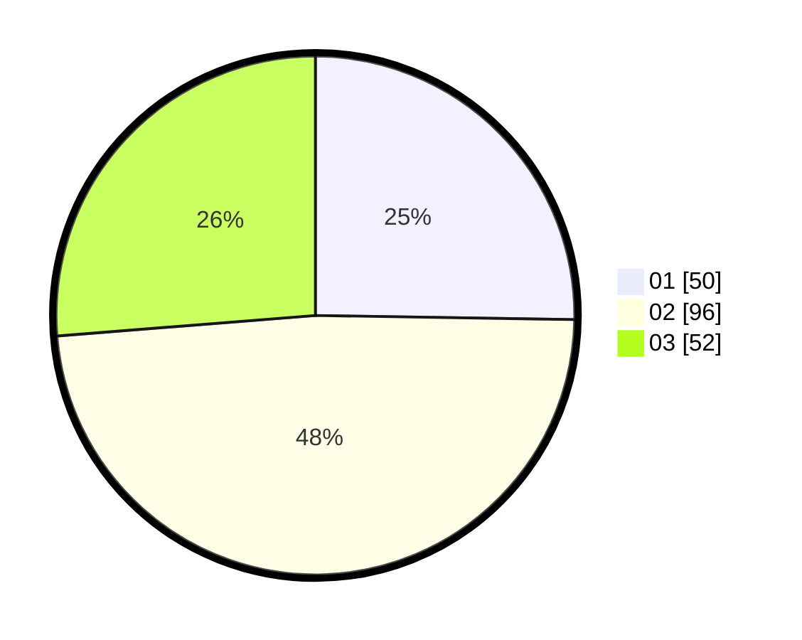

# Hasil

Hasil perolehan suara paslon dapat dilihat pada file paslon-01.txt, paslon-02.txt, dan paslon-03.txt.

Jika tidak ada, artinya data tersebut belum ada pada SIREKAP.

## Perolehan Suara

 * Paslon 01: **50**.
 * Paslon 02: **96**.
 * Paslon 03: **52**.

## Foto C Plano

https://sirekap-obj-formc.kpu.go.id/1abb/pemilu/ppwp/31/74/06/10/03/3174061003027-20240214-221114--e1af03e7-d626-43ab-b481-09aeffffb5b7.jpg

https://sirekap-obj-formc.kpu.go.id/1abb/pemilu/ppwp/31/74/06/10/03/3174061003027-20240214-221156--449ad2f1-15d6-4262-ae9d-075301eea08d.jpg

https://sirekap-obj-formc.kpu.go.id/1abb/pemilu/ppwp/31/74/06/10/03/3174061003027-20240214-221359--bb051902-f632-4d10-9bbc-ceeed7364c0a.jpg

## DATA PEMILIH TETAP

Jumlah pemilih dalam DPT: **261**.
 * L: **129**.
 * P: **132**.

## DATA PENGGUNA HAK PILIH

Jumlah pengguna hak pilih dalam DPT: **201**.
 * L: **102**.
 * P: **99**.

Jumlah pengguna hak pilih dalam DPTb: **0**.
 * L: **0**.
 * P: **0**.

Jumlah pengguna hak pilih dalam DPK: **1**.
 * L: **0**.
 * P: **1**.

Jumlah pengguna hak pilih: **202**.
 * L: **102**.
 * P: **100**.

## JUMLAH SUARA SAH DAN TIDAK SAH

JUMLAH SELURUH SUARA SAH: **198**.

JUMLAH SUARA TIDAK SAH: **4**.

JUMLAH SELURUH SUARA SAH DAN SUARA TIDAK SAH: **202**.
