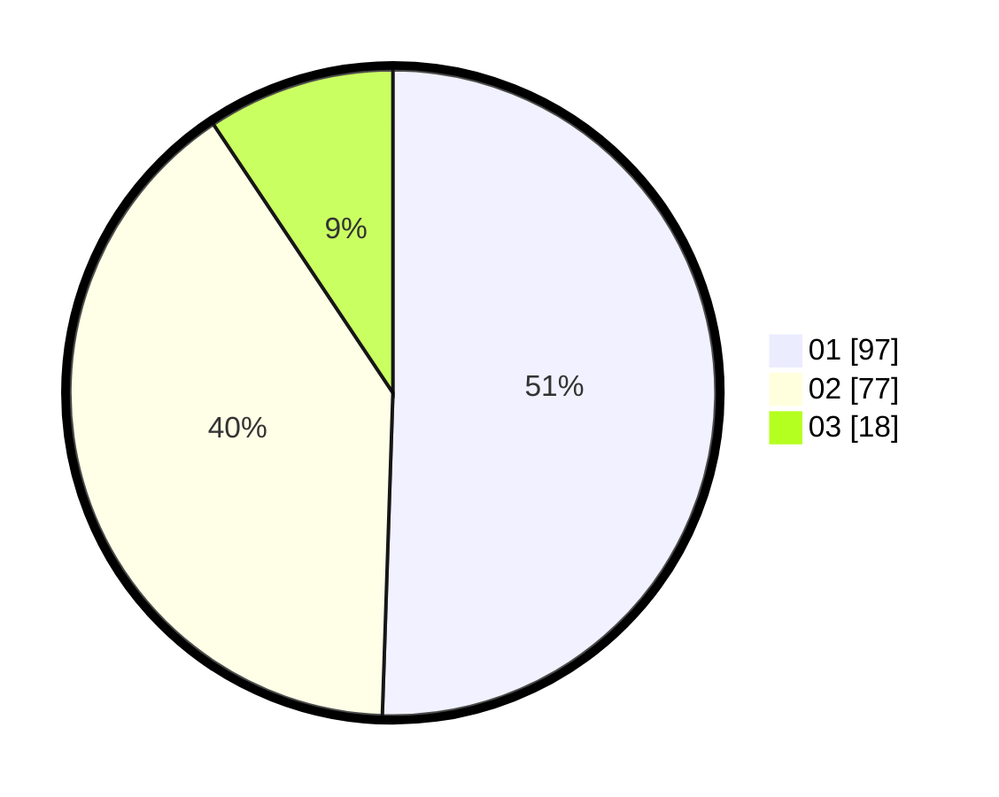

# Hasil

Hasil perolehan suara paslon dapat dilihat pada file paslon-01.txt, paslon-02.txt, dan paslon-03.txt.

Jika tidak ada, artinya data tersebut belum ada pada SIREKAP.

## Perolehan Suara

 * Paslon 01: **97**.
 * Paslon 02: **77**.
 * Paslon 03: **18**.

## Foto C Plano

https://sirekap-obj-formc.kpu.go.id/ded8/pemilu/ppwp/31/74/06/10/03/3174061003047-20240215-130443--1dfd5f00-296d-4adf-aad0-0685c78e4c78.jpg

https://sirekap-obj-formc.kpu.go.id/ded8/pemilu/ppwp/31/74/06/10/03/3174061003047-20240215-125911--da41181c-540a-4696-9dea-796e9c10ef13.jpg

https://sirekap-obj-formc.kpu.go.id/ded8/pemilu/ppwp/31/74/06/10/03/3174061003047-20240215-011127--14563843-97f7-406f-a82d-85bb0335c925.jpg
