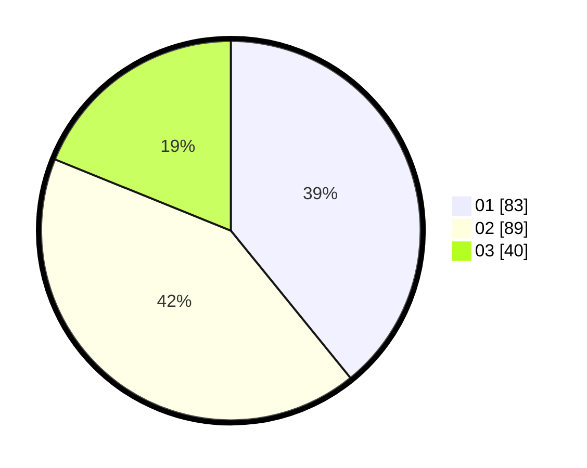

# Hasil

Hasil perolehan suara paslon dapat dilihat pada file paslon-01.txt, paslon-02.txt, dan paslon-03.txt.

Jika tidak ada, artinya data tersebut belum ada pada SIREKAP.

## Perolehan Suara

 * Paslon 01: **83**.
 * Paslon 02: **89**.
 * Paslon 03: **40**.

## Foto C Plano

https://sirekap-obj-formc.kpu.go.id/c112/pemilu/ppwp/31/74/06/10/03/3174061003048-20240215-002505--fb9e4a84-03db-4729-a060-dea210862139.jpg

https://sirekap-obj-formc.kpu.go.id/c112/pemilu/ppwp/31/74/06/10/03/3174061003048-20240215-002618--996ccd15-1d9e-4869-a137-2d17cc2d2f96.jpg

https://sirekap-obj-formc.kpu.go.id/c112/pemilu/ppwp/31/74/06/10/03/3174061003048-20240215-002737--088767dd-7a8e-4e60-808f-f853ee0b0232.jpg

## DATA PEMILIH TETAP

Jumlah pemilih dalam DPT: **267**.
 * L: **131**.
 * P: **136**.

## DATA PENGGUNA HAK PILIH

Jumlah pengguna hak pilih dalam DPT: **210**.
 * L: **103**.
 * P: **107**.

Jumlah pengguna hak pilih dalam DPTb: **0**.
 * L: **0**.
 * P: **0**.

Jumlah pengguna hak pilih dalam DPK: **2**.
 * L: **0**.
 * P: **2**.

Jumlah pengguna hak pilih: **212**.
 * L: **103**.
 * P: **109**.

## JUMLAH SUARA SAH DAN TIDAK SAH

JUMLAH SELURUH SUARA SAH: **212**.

JUMLAH SUARA TIDAK SAH: **0**.

JUMLAH SELURUH SUARA SAH DAN SUARA TIDAK SAH: **212**.
