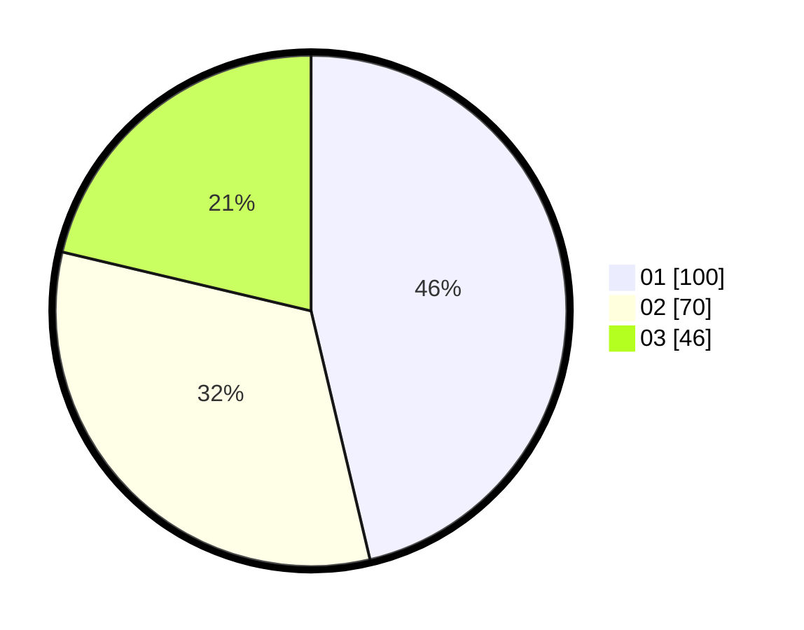

# Hasil

Hasil perolehan suara paslon dapat dilihat pada file paslon-01.txt, paslon-02.txt, dan paslon-03.txt.

Jika tidak ada, artinya data tersebut belum ada pada SIREKAP.

## Perolehan Suara

 * Paslon 01: **100**.
 * Paslon 02: **70**.
 * Paslon 03: **46**.

## Foto C Plano

https://sirekap-obj-formc.kpu.go.id/9ef9/pemilu/ppwp/31/74/06/10/03/3174061003049-20240214-211339--2a438e0f-de90-48d2-88ec-7ed7f73d2497.jpg

https://sirekap-obj-formc.kpu.go.id/9ef9/pemilu/ppwp/31/74/06/10/03/3174061003049-20240214-155406--efbd317e-da5e-49dd-a0bb-7feec17b0bc7.jpg

https://sirekap-obj-formc.kpu.go.id/9ef9/pemilu/ppwp/31/74/06/10/03/3174061003049-20240214-155529--2c7cde89-9cca-4c43-8e3b-6c1c65cd1f6e.jpg

## DATA PEMILIH TETAP

Jumlah pemilih dalam DPT: **269**.
 * L: **128**.
 * P: **141**.

## DATA PENGGUNA HAK PILIH

Jumlah pengguna hak pilih dalam DPT: **215**.
 * L: **100**.
 * P: **115**.

Jumlah pengguna hak pilih dalam DPTb: **0**.
 * L: **0**.
 * P: **0**.

Jumlah pengguna hak pilih dalam DPK: **3**.
 * L: **2**.
 * P: **1**.

Jumlah pengguna hak pilih: **218**.
 * L: **102**.
 * P: **116**.

## JUMLAH SUARA SAH DAN TIDAK SAH

JUMLAH SELURUH SUARA SAH: **216**.

JUMLAH SUARA TIDAK SAH: **2**.

JUMLAH SELURUH SUARA SAH DAN SUARA TIDAK SAH: **218**.
