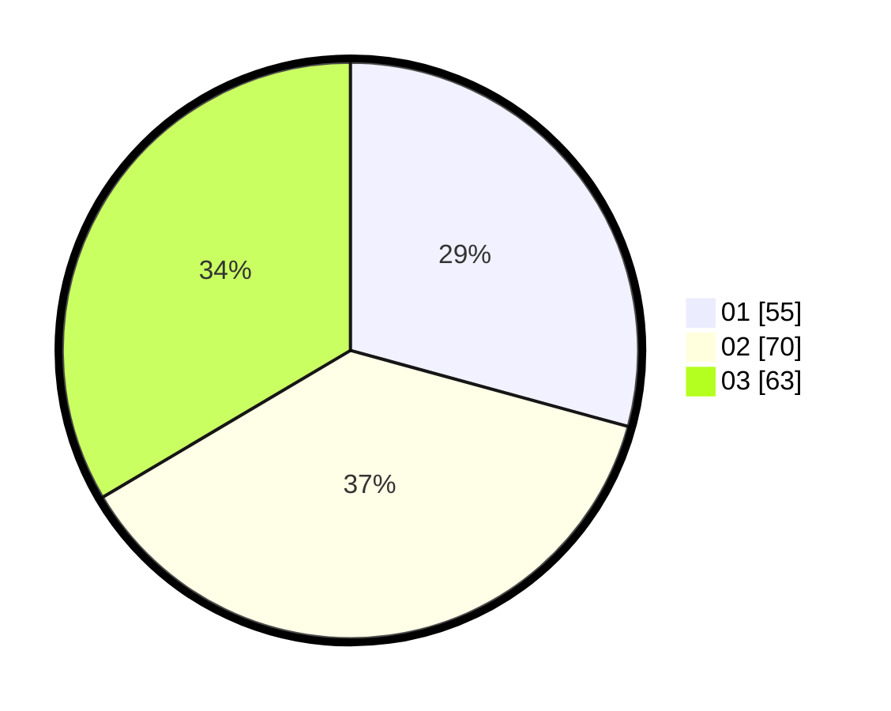

# Hasil

Hasil perolehan suara paslon dapat dilihat pada file paslon-01.txt, paslon-02.txt, dan paslon-03.txt.

Jika tidak ada, artinya data tersebut belum ada pada SIREKAP.

## Perolehan Suara

 * Paslon 01: **55**.
 * Paslon 02: **70**.
 * Paslon 03: **63**.

## Foto C Plano

https://sirekap-obj-formc.kpu.go.id/5fe8/pemilu/ppwp/31/74/06/10/03/3174061003052-20240214-194727--131e00a0-4590-46a9-8411-28fc9c811992.jpg

https://sirekap-obj-formc.kpu.go.id/5fe8/pemilu/ppwp/31/74/06/10/03/3174061003052-20240214-195253--1afcba72-659b-48e1-9cb6-0004d69d9c3b.jpg

https://sirekap-obj-formc.kpu.go.id/5fe8/pemilu/ppwp/31/74/06/10/03/3174061003052-20240214-195349--fecb4026-66b0-4089-a5ea-e6384f0f0c46.jpg

## DATA PEMILIH TETAP

Jumlah pemilih dalam DPT: **249**.
 * L: **123**.
 * P: **126**.

## DATA PENGGUNA HAK PILIH

Jumlah pengguna hak pilih dalam DPT: **199**.
 * L: **93**.
 * P: **106**.

Jumlah pengguna hak pilih dalam DPTb: **0**.
 * L: **0**.
 * P: **0**.

Jumlah pengguna hak pilih dalam DPK: **0**.
 * L: **0**.
 * P: **0**.

Jumlah pengguna hak pilih: **199**.
 * L: **93**.
 * P: **106**.

## JUMLAH SUARA SAH DAN TIDAK SAH

JUMLAH SELURUH SUARA SAH: **198**.

JUMLAH SUARA TIDAK SAH: **1**.

JUMLAH SELURUH SUARA SAH DAN SUARA TIDAK SAH: **199**.
