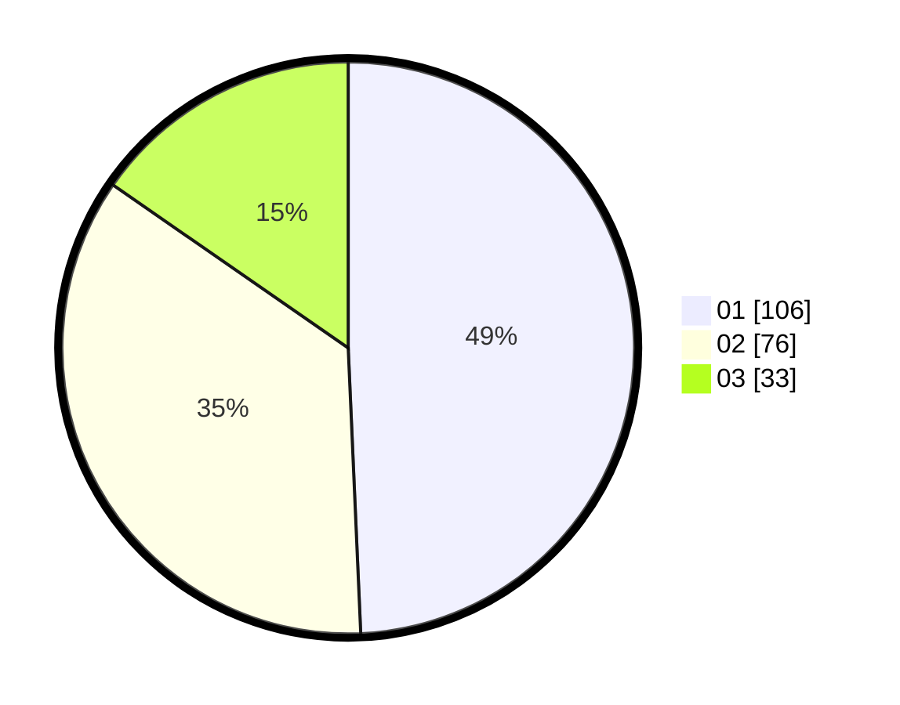

# Hasil

Hasil perolehan suara paslon dapat dilihat pada file paslon-01.txt, paslon-02.txt, dan paslon-03.txt.

Jika tidak ada, artinya data tersebut belum ada pada SIREKAP.

## Perolehan Suara

 * Paslon 01: **106**.
 * Paslon 02: **76**.
 * Paslon 03: **33**.

## Foto C Plano

https://sirekap-obj-formc.kpu.go.id/101b/pemilu/ppwp/31/74/06/10/03/3174061003057-20240216-165314--788c891f-e481-44f5-9ae5-3a297b80f641.jpg

https://sirekap-obj-formc.kpu.go.id/101b/pemilu/ppwp/31/74/06/10/03/3174061003057-20240216-165315--63532e45-7ae9-4988-a7ff-fbde561f3d4d.jpg

https://sirekap-obj-formc.kpu.go.id/101b/pemilu/ppwp/31/74/06/10/03/3174061003057-20240216-165314--cb4b14c6-330a-4ca3-8884-bb1863dbad30.jpg

## DATA PEMILIH TETAP

Jumlah pemilih dalam DPT: **274**.
 * L: **131**.
 * P: **143**.

## DATA PENGGUNA HAK PILIH

Jumlah pengguna hak pilih dalam DPT: **214**.
 * L: **103**.
 * P: **111**.

Jumlah pengguna hak pilih dalam DPTb: **1**.
 * L: **1**.
 * P: **0**.

Jumlah pengguna hak pilih dalam DPK: **2**.
 * L: **2**.
 * P: **0**.

Jumlah pengguna hak pilih: **217**.
 * L: **106**.
 * P: **111**.

## JUMLAH SUARA SAH DAN TIDAK SAH

JUMLAH SELURUH SUARA SAH: **215**.

JUMLAH SUARA TIDAK SAH: **2**.

JUMLAH SELURUH SUARA SAH DAN SUARA TIDAK SAH: **217**.
