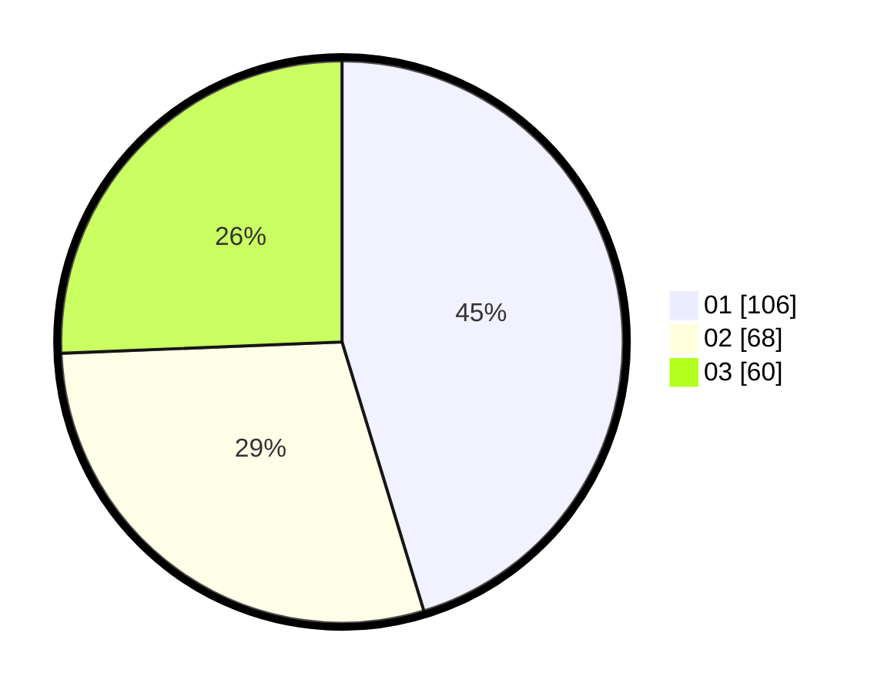

# Hasil

Hasil perolehan suara paslon dapat dilihat pada file paslon-01.txt, paslon-02.txt, dan paslon-03.txt.

Jika tidak ada, artinya data tersebut belum ada pada SIREKAP.

## Perolehan Suara

 * Paslon 01: **106**.
 * Paslon 02: **68**.
 * Paslon 03: **60**.

## Foto C Plano

https://sirekap-obj-formc.kpu.go.id/4a67/pemilu/ppwp/31/74/06/10/03/3174061003069-20240217-141018--0a22581b-a707-4c2e-a942-f822d8d62617.jpg

https://sirekap-obj-formc.kpu.go.id/4a67/pemilu/ppwp/31/74/06/10/03/3174061003069-20240214-214443--725c02d9-2b44-4491-8157-5fdbd2644908.jpg

https://sirekap-obj-formc.kpu.go.id/4a67/pemilu/ppwp/31/74/06/10/03/3174061003069-20240214-214600--6ab68b42-598e-405b-a8cd-6ed65d57bf83.jpg
