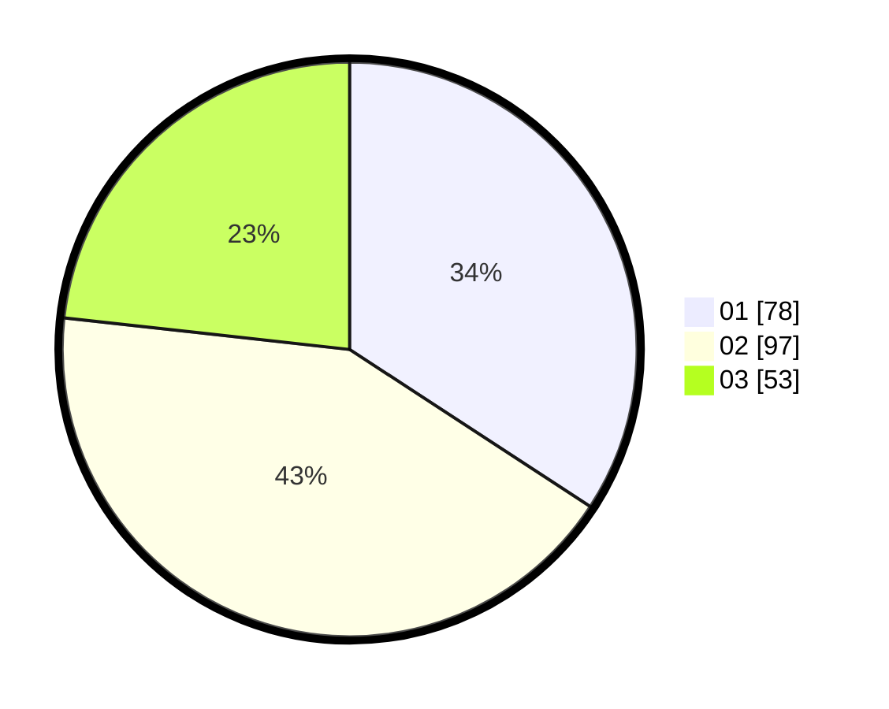

# Hasil

Hasil perolehan suara paslon dapat dilihat pada file paslon-01.txt, paslon-02.txt, dan paslon-03.txt.

Jika tidak ada, artinya data tersebut belum ada pada SIREKAP.

## Perolehan Suara

 * Paslon 01: **78**.
 * Paslon 02: **97**.
 * Paslon 03: **53**.

## Foto C Plano

https://sirekap-obj-formc.kpu.go.id/e62f/pemilu/ppwp/31/74/06/10/03/3174061003073-20240214-160059--2b6af740-008c-40a4-9f34-0f3dd4a3849f.jpg

https://sirekap-obj-formc.kpu.go.id/e62f/pemilu/ppwp/31/74/06/10/03/3174061003073-20240214-155927--8ee7ea80-a4b9-443e-842c-e717d7aa1e1d.jpg

https://sirekap-obj-formc.kpu.go.id/e62f/pemilu/ppwp/31/74/06/10/03/3174061003073-20240214-155915--bfe038fd-7713-45b2-bc23-0220016d9c3e.jpg

## DATA PEMILIH TETAP

Jumlah pemilih dalam DPT: **270**.
 * L: **136**.
 * P: **134**.

## DATA PENGGUNA HAK PILIH

Jumlah pengguna hak pilih dalam DPT: **232**.
 * L: **116**.
 * P: **116**.

Jumlah pengguna hak pilih dalam DPTb: **0**.
 * L: **0**.
 * P: **0**.

Jumlah pengguna hak pilih dalam DPK: **0**.
 * L: **0**.
 * P: **0**.

Jumlah pengguna hak pilih: **232**.
 * L: **116**.
 * P: **116**.

## JUMLAH SUARA SAH DAN TIDAK SAH

JUMLAH SELURUH SUARA SAH: **228**.

JUMLAH SUARA TIDAK SAH: **4**.

JUMLAH SELURUH SUARA SAH DAN SUARA TIDAK SAH: **232**.
