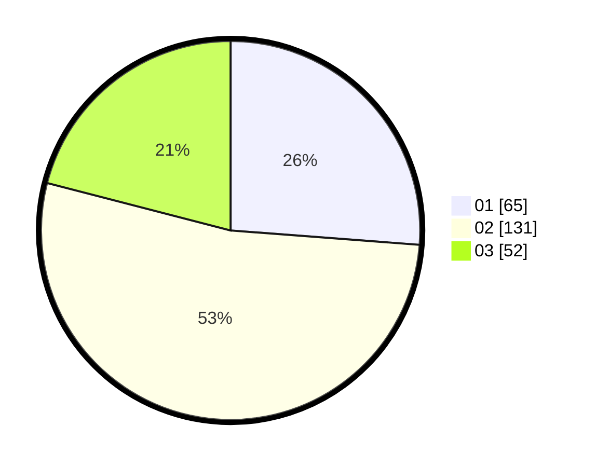

# Hasil

Hasil perolehan suara paslon dapat dilihat pada file paslon-01.txt, paslon-02.txt, dan paslon-03.txt.

Jika tidak ada, artinya data tersebut belum ada pada SIREKAP.

## Perolehan Suara

 * Paslon 01: **65**.
 * Paslon 02: **131**.
 * Paslon 03: **52**.

## Foto C Plano

https://sirekap-obj-formc.kpu.go.id/f87e/pemilu/ppwp/31/74/06/10/03/3174061003082-20240218-140032--a8a40fc8-ffff-41f8-b752-a9810d673326.jpg

https://sirekap-obj-formc.kpu.go.id/f87e/pemilu/ppwp/31/74/06/10/03/3174061003082-20240217-140137--37b54094-f77c-4149-b348-843353f8330d.jpg

https://sirekap-obj-formc.kpu.go.id/f87e/pemilu/ppwp/31/74/06/10/03/3174061003082-20240217-172427--29cc013d-0827-450b-acd7-8c927e8ae2ca.jpg

## DATA PEMILIH TETAP

Jumlah pemilih dalam DPT: **281**.
 * L: **127**.
 * P: **154**.

## DATA PENGGUNA HAK PILIH

Jumlah pengguna hak pilih dalam DPT: **248**.
 * L: **111**.
 * P: **137**.

Jumlah pengguna hak pilih dalam DPTb: **0**.
 * L: **0**.
 * P: **0**.

Jumlah pengguna hak pilih dalam DPK: **2**.
 * L: **0**.
 * P: **2**.

Jumlah pengguna hak pilih: **250**.
 * L: **111**.
 * P: **139**.

## JUMLAH SUARA SAH DAN TIDAK SAH

JUMLAH SELURUH SUARA SAH: **248**.

JUMLAH SUARA TIDAK SAH: **2**.

JUMLAH SELURUH SUARA SAH DAN SUARA TIDAK SAH: **250**.
