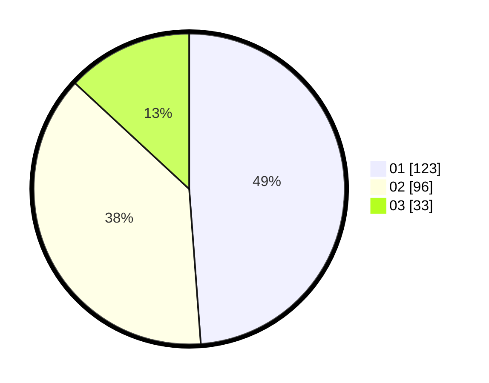

# Hasil

Hasil perolehan suara paslon dapat dilihat pada file paslon-01.txt, paslon-02.txt, dan paslon-03.txt.

Jika tidak ada, artinya data tersebut belum ada pada SIREKAP.

## Perolehan Suara

 * Paslon 01: **123**.
 * Paslon 02: **96**.
 * Paslon 03: **33**.

## Foto C Plano

https://sirekap-obj-formc.kpu.go.id/c25d/pemilu/ppwp/31/74/06/10/03/3174061003091-20240214-205053--e2eefef8-ffbd-4e6c-ad94-cb08fbfafae7.jpg

https://sirekap-obj-formc.kpu.go.id/c25d/pemilu/ppwp/31/74/06/10/03/3174061003091-20240214-205152--55a70484-f6af-41cf-90ed-53ad4b86260a.jpg

https://sirekap-obj-formc.kpu.go.id/c25d/pemilu/ppwp/31/74/06/10/03/3174061003091-20240214-205253--a721df1d-c314-4811-bc64-dac6bc9a9b33.jpg

## DATA PEMILIH TETAP

Jumlah pemilih dalam DPT: **292**.
 * L: **153**.
 * P: **139**.

## DATA PENGGUNA HAK PILIH

Jumlah pengguna hak pilih dalam DPT: **250**.
 * L: **127**.
 * P: **123**.

Jumlah pengguna hak pilih dalam DPTb: **3**.
 * L: **2**.
 * P: **1**.

Jumlah pengguna hak pilih dalam DPK: **0**.
 * L: **0**.
 * P: **0**.

Jumlah pengguna hak pilih: **253**.
 * L: **129**.
 * P: **124**.

## JUMLAH SUARA SAH DAN TIDAK SAH

JUMLAH SELURUH SUARA SAH: **252**.

JUMLAH SUARA TIDAK SAH: **1**.

JUMLAH SELURUH SUARA SAH DAN SUARA TIDAK SAH: **253**.
