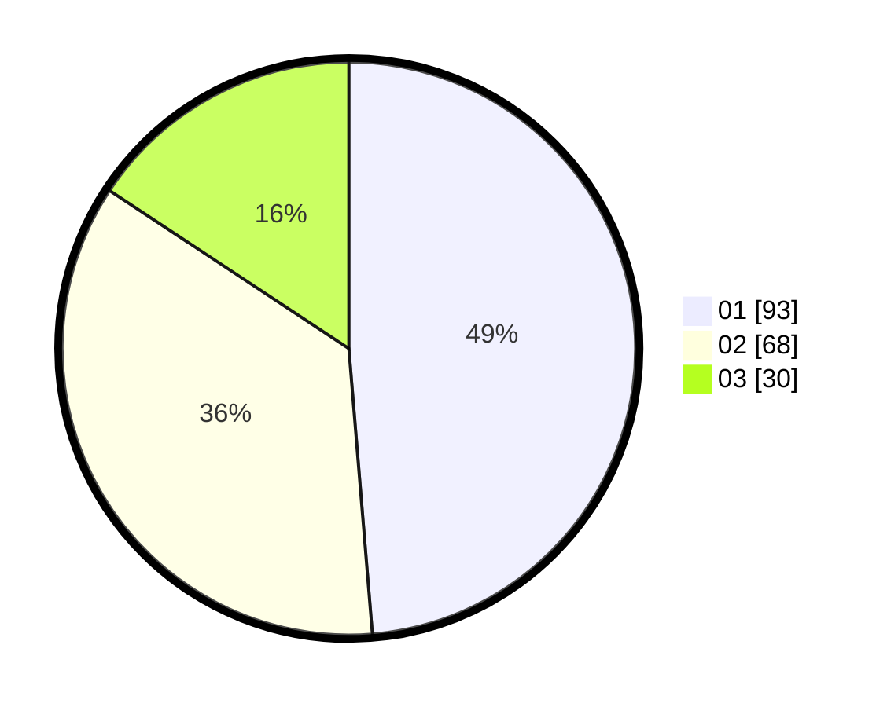

# Hasil

Hasil perolehan suara paslon dapat dilihat pada file paslon-01.txt, paslon-02.txt, dan paslon-03.txt.

Jika tidak ada, artinya data tersebut belum ada pada SIREKAP.

## Perolehan Suara

 * Paslon 01: **93**.
 * Paslon 02: **68**.
 * Paslon 03: **30**.

## Foto C Plano

https://sirekap-obj-formc.kpu.go.id/22e6/pemilu/ppwp/31/74/06/10/03/3174061003097-20240214-234217--92395874-0263-4c8a-bbb8-312058c68f1a.jpg

https://sirekap-obj-formc.kpu.go.id/22e6/pemilu/ppwp/31/74/06/10/03/3174061003097-20240214-160140--e289c6d0-2f55-4229-84b1-c609e27fa0ec.jpg

https://sirekap-obj-formc.kpu.go.id/22e6/pemilu/ppwp/31/74/06/10/03/3174061003097-20240214-234208--87b5810c-2b02-4cc2-9ccb-19cb558faf1e.jpg
