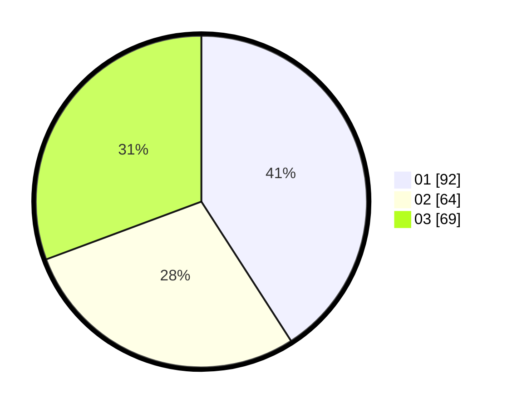

# Hasil

Hasil perolehan suara paslon dapat dilihat pada file paslon-01.txt, paslon-02.txt, dan paslon-03.txt.

Jika tidak ada, artinya data tersebut belum ada pada SIREKAP.

## Perolehan Suara

 * Paslon 01: **92**.
 * Paslon 02: **64**.
 * Paslon 03: **69**.

## Foto C Plano

https://sirekap-obj-formc.kpu.go.id/b7c5/pemilu/ppwp/31/74/06/10/03/3174061003106-20240214-222932--76d3e872-2c88-4a34-9e8a-56379153518f.jpg

https://sirekap-obj-formc.kpu.go.id/b7c5/pemilu/ppwp/31/74/06/10/03/3174061003106-20240214-194444--e4d6d1a8-0a7d-41e1-951b-79be319a423f.jpg

https://sirekap-obj-formc.kpu.go.id/b7c5/pemilu/ppwp/31/74/06/10/03/3174061003106-20240214-194453--03128911-2612-40d0-9cad-fcf6aad26ad9.jpg
