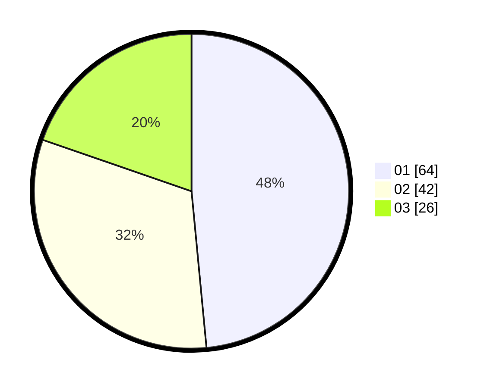

# Hasil

Hasil perolehan suara paslon dapat dilihat pada file paslon-01.txt, paslon-02.txt, dan paslon-03.txt.

Jika tidak ada, artinya data tersebut belum ada pada SIREKAP.

## Perolehan Suara

 * Paslon 01: **64**.
 * Paslon 02: **42**.
 * Paslon 03: **26**.

## Foto C Plano

https://sirekap-obj-formc.kpu.go.id/d1af/pemilu/ppwp/31/74/06/10/03/3174061003114-20240214-194458--4594c012-5009-4ccb-ba7b-d6089d969b6d.jpg

https://sirekap-obj-formc.kpu.go.id/d1af/pemilu/ppwp/31/74/06/10/03/3174061003114-20240214-194800--71bb8318-5448-4b91-be9b-386fd8a7fcb6.jpg

https://sirekap-obj-formc.kpu.go.id/d1af/pemilu/ppwp/31/74/06/10/03/3174061003114-20240214-194923--a0f754a9-f112-49e8-99ac-8141a12744b5.jpg

## DATA PEMILIH TETAP

Jumlah pemilih dalam DPT: **152**.
 * L: **64**.
 * P: **83**.

## DATA PENGGUNA HAK PILIH

Jumlah pengguna hak pilih dalam DPT: **133**.
 * L: **55**.
 * P: **78**.

Jumlah pengguna hak pilih dalam DPTb: **0**.
 * L: **0**.
 * P: **0**.

Jumlah pengguna hak pilih dalam DPK: **2**.
 * L: **1**.
 * P: **1**.

Jumlah pengguna hak pilih: **135**.
 * L: **56**.
 * P: **79**.

## JUMLAH SUARA SAH DAN TIDAK SAH

JUMLAH SELURUH SUARA SAH: **132**.

JUMLAH SUARA TIDAK SAH: **3**.

JUMLAH SELURUH SUARA SAH DAN SUARA TIDAK SAH: **135**.
