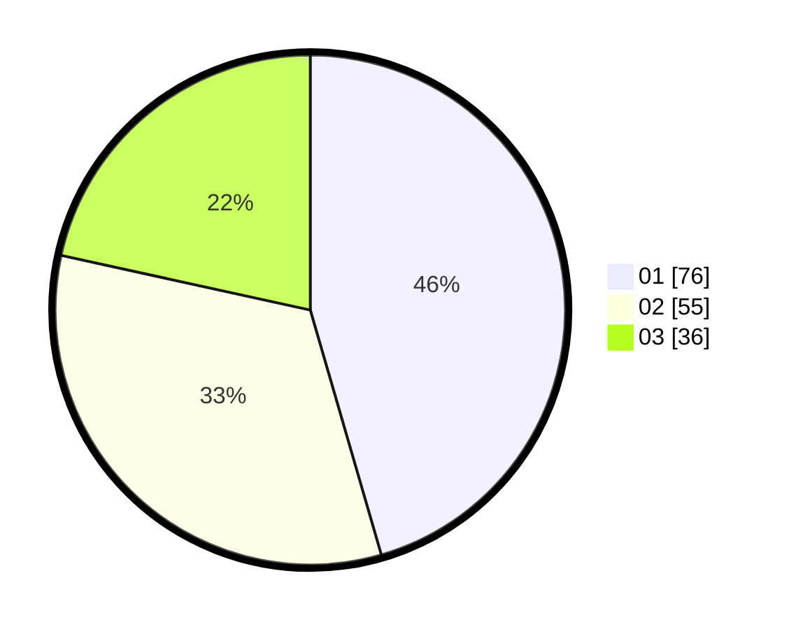

# Hasil

Hasil perolehan suara paslon dapat dilihat pada file paslon-01.txt, paslon-02.txt, dan paslon-03.txt.

Jika tidak ada, artinya data tersebut belum ada pada SIREKAP.

## Perolehan Suara

 * Paslon 01: **76**.
 * Paslon 02: **55**.
 * Paslon 03: **36**.

## Foto C Plano

https://sirekap-obj-formc.kpu.go.id/3f40/pemilu/ppwp/31/74/06/10/03/3174061003115-20240214-155906--85c1369e-2af9-4321-91e6-0a204b786492.jpg

https://sirekap-obj-formc.kpu.go.id/3f40/pemilu/ppwp/31/74/06/10/03/3174061003115-20240214-155926--f4a2f936-230a-471b-a079-d825fa0aeef7.jpg

https://sirekap-obj-formc.kpu.go.id/3f40/pemilu/ppwp/31/74/06/10/03/3174061003115-20240214-160100--3a370af2-9e50-4594-ba0b-6674e80717d2.jpg

## DATA PEMILIH TETAP

Jumlah pemilih dalam DPT: **201**.
 * L: **96**.
 * P: **105**.

## DATA PENGGUNA HAK PILIH

Jumlah pengguna hak pilih dalam DPT: **168**.
 * L: **86**.
 * P: **82**.

Jumlah pengguna hak pilih dalam DPTb: **0**.
 * L: **0**.
 * P: **0**.

Jumlah pengguna hak pilih dalam DPK: **3**.
 * L: **2**.
 * P: **1**.

Jumlah pengguna hak pilih: **171**.
 * L: **88**.
 * P: **83**.

## JUMLAH SUARA SAH DAN TIDAK SAH

JUMLAH SELURUH SUARA SAH: **167**.

JUMLAH SUARA TIDAK SAH: **4**.

JUMLAH SELURUH SUARA SAH DAN SUARA TIDAK SAH: **171**.
