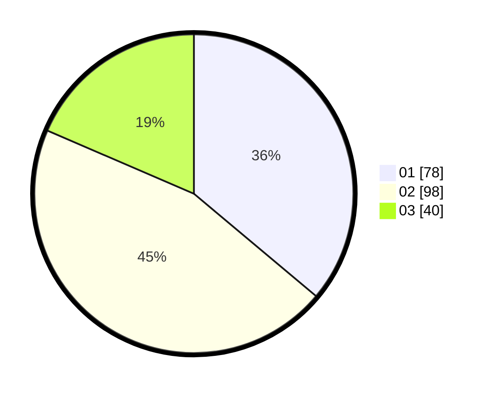

# Hasil

Hasil perolehan suara paslon dapat dilihat pada file paslon-01.txt, paslon-02.txt, dan paslon-03.txt.

Jika tidak ada, artinya data tersebut belum ada pada SIREKAP.

## Perolehan Suara

 * Paslon 01: **78**.
 * Paslon 02: **98**.
 * Paslon 03: **40**.

## Foto C Plano

https://sirekap-obj-formc.kpu.go.id/bb1e/pemilu/ppwp/31/74/06/10/03/3174061003142-20240214-191813--0c70fccc-62a8-45bf-8ddf-19dc7b0b8a11.jpg

https://sirekap-obj-formc.kpu.go.id/bb1e/pemilu/ppwp/31/74/06/10/03/3174061003142-20240214-194850--e898be56-e8d5-4d1f-b8a9-2f9ef20544b1.jpg

https://sirekap-obj-formc.kpu.go.id/bb1e/pemilu/ppwp/31/74/06/10/03/3174061003142-20240214-184519--45abf918-ab71-4a24-a72f-57f050a5ba15.jpg

## DATA PEMILIH TETAP

Jumlah pemilih dalam DPT: **216**.
 * L: **98**.
 * P: **118**.

## DATA PENGGUNA HAK PILIH

Jumlah pengguna hak pilih dalam DPT: **216**.
 * L: **98**.
 * P: **118**.

Jumlah pengguna hak pilih dalam DPTb: **1**.
 * L: **0**.
 * P: **1**.

Jumlah pengguna hak pilih dalam DPK: **1**.
 * L: **0**.
 * P: **1**.

Jumlah pengguna hak pilih: **218**.
 * L: **98**.
 * P: **120**.

## JUMLAH SUARA SAH DAN TIDAK SAH

JUMLAH SELURUH SUARA SAH: **216**.

JUMLAH SUARA TIDAK SAH: **2**.

JUMLAH SELURUH SUARA SAH DAN SUARA TIDAK SAH: **218**.
