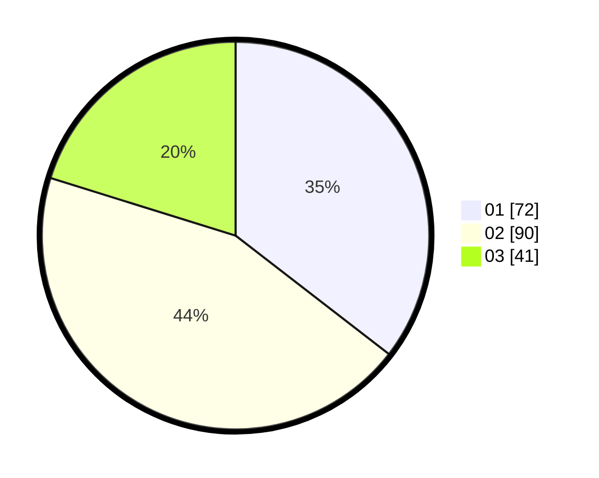

# Hasil

Hasil perolehan suara paslon dapat dilihat pada file paslon-01.txt, paslon-02.txt, dan paslon-03.txt.

Jika tidak ada, artinya data tersebut belum ada pada SIREKAP.

## Perolehan Suara

 * Paslon 01: **72**.
 * Paslon 02: **90**.
 * Paslon 03: **41**.

## Foto C Plano

https://sirekap-obj-formc.kpu.go.id/9c29/pemilu/ppwp/31/74/06/10/03/3174061003149-20240214-190314--8b0e61b1-be52-4659-ac54-f60661d3c783.jpg

https://sirekap-obj-formc.kpu.go.id/9c29/pemilu/ppwp/31/74/06/10/03/3174061003149-20240214-185244--99bec2ab-eae2-4842-8e4d-d9373421471b.jpg

https://sirekap-obj-formc.kpu.go.id/9c29/pemilu/ppwp/31/74/06/10/03/3174061003149-20240214-185250--2380e7fc-25ef-4816-909b-5c87545e2ea4.jpg

## DATA PEMILIH TETAP

Jumlah pemilih dalam DPT: **243**.
 * L: **123**.
 * P: **120**.

## DATA PENGGUNA HAK PILIH

Jumlah pengguna hak pilih dalam DPT: **205**.
 * L: **101**.
 * P: **104**.

Jumlah pengguna hak pilih dalam DPTb: **2**.
 * L: **1**.
 * P: **1**.

Jumlah pengguna hak pilih dalam DPK: **2**.
 * L: **1**.
 * P: **1**.

Jumlah pengguna hak pilih: **209**.
 * L: **103**.
 * P: **106**.

## JUMLAH SUARA SAH DAN TIDAK SAH

JUMLAH SELURUH SUARA SAH: **203**.

JUMLAH SUARA TIDAK SAH: **6**.

JUMLAH SELURUH SUARA SAH DAN SUARA TIDAK SAH: **209**.
