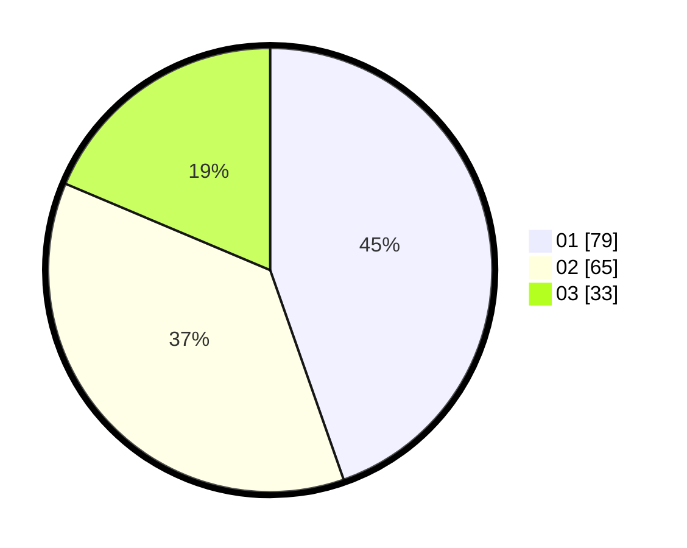

# Hasil

Hasil perolehan suara paslon dapat dilihat pada file paslon-01.txt, paslon-02.txt, dan paslon-03.txt.

Jika tidak ada, artinya data tersebut belum ada pada SIREKAP.

## Perolehan Suara

 * Paslon 01: **79**.
 * Paslon 02: **65**.
 * Paslon 03: **33**.

## Foto C Plano

https://sirekap-obj-formc.kpu.go.id/ea41/pemilu/ppwp/31/74/06/10/03/3174061003151-20240214-155735--b53349ba-8c3e-499a-9f0f-c887a4b94ac0.jpg

https://sirekap-obj-formc.kpu.go.id/ea41/pemilu/ppwp/31/74/06/10/03/3174061003151-20240214-155207--ee7c2b3f-7db2-405b-a73c-14e1c57f417b.jpg

https://sirekap-obj-formc.kpu.go.id/ea41/pemilu/ppwp/31/74/06/10/03/3174061003151-20240214-155823--3e1fd50e-ab52-4b94-af02-32d3b4317642.jpg

## DATA PEMILIH TETAP

Jumlah pemilih dalam DPT: **212**.
 * L: **105**.
 * P: **107**.

## DATA PENGGUNA HAK PILIH

Jumlah pengguna hak pilih dalam DPT: **184**.
 * L: **87**.
 * P: **97**.

Jumlah pengguna hak pilih dalam DPTb: **0**.
 * L: **0**.
 * P: **0**.

Jumlah pengguna hak pilih dalam DPK: **3**.
 * L: **1**.
 * P: **2**.

Jumlah pengguna hak pilih: **187**.
 * L: **88**.
 * P: **99**.

## JUMLAH SUARA SAH DAN TIDAK SAH

JUMLAH SELURUH SUARA SAH: **177**.

JUMLAH SUARA TIDAK SAH: **10**.

JUMLAH SELURUH SUARA SAH DAN SUARA TIDAK SAH: **187**.
