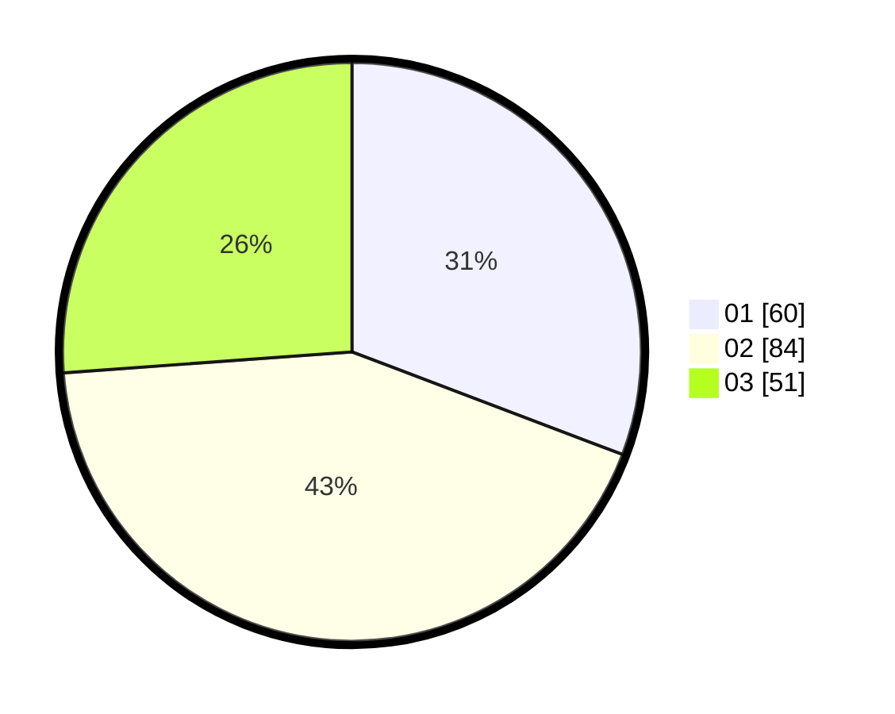

# Hasil

Hasil perolehan suara paslon dapat dilihat pada file paslon-01.txt, paslon-02.txt, dan paslon-03.txt.

Jika tidak ada, artinya data tersebut belum ada pada SIREKAP.

## Perolehan Suara

 * Paslon 01: **60**.
 * Paslon 02: **84**.
 * Paslon 03: **51**.

## Foto C Plano

https://sirekap-obj-formc.kpu.go.id/a157/pemilu/ppwp/31/74/06/10/03/3174061003152-20240214-230813--e588de62-28b8-42a9-bdc4-f9203fe27c7c.jpg

https://sirekap-obj-formc.kpu.go.id/a157/pemilu/ppwp/31/74/06/10/03/3174061003152-20240214-230908--38223266-6ba4-4b30-9487-8b952fea4541.jpg

https://sirekap-obj-formc.kpu.go.id/a157/pemilu/ppwp/31/74/06/10/03/3174061003152-20240214-231007--e719b300-41bc-4100-950c-2e27e5164977.jpg

## DATA PEMILIH TETAP

Jumlah pemilih dalam DPT: **254**.
 * L: **124**.
 * P: **130**.

## DATA PENGGUNA HAK PILIH

Jumlah pengguna hak pilih dalam DPT: **198**.
 * L: **93**.
 * P: **105**.

Jumlah pengguna hak pilih dalam DPTb: **0**.
 * L: **0**.
 * P: **0**.

Jumlah pengguna hak pilih dalam DPK: **2**.
 * L: **1**.
 * P: **1**.

Jumlah pengguna hak pilih: **200**.
 * L: **94**.
 * P: **106**.

## JUMLAH SUARA SAH DAN TIDAK SAH

JUMLAH SELURUH SUARA SAH: **195**.

JUMLAH SUARA TIDAK SAH: **5**.

JUMLAH SELURUH SUARA SAH DAN SUARA TIDAK SAH: **200**.
