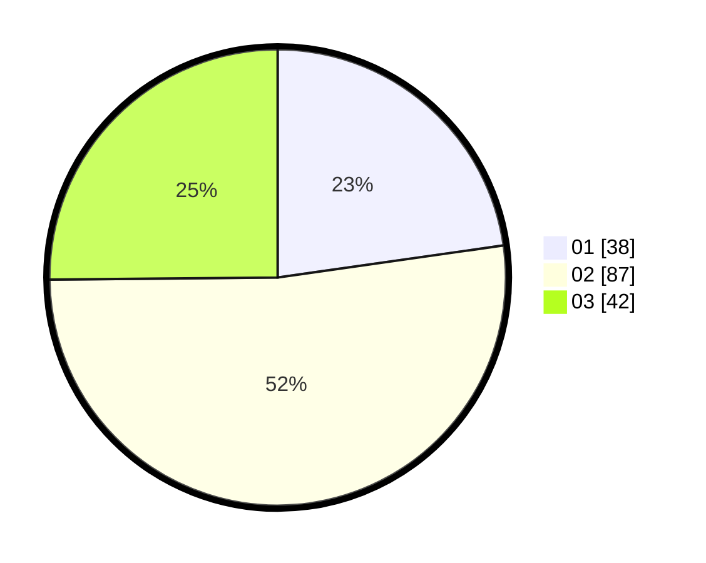

# Hasil

Hasil perolehan suara paslon dapat dilihat pada file paslon-01.txt, paslon-02.txt, dan paslon-03.txt.

Jika tidak ada, artinya data tersebut belum ada pada SIREKAP.

## Perolehan Suara

 * Paslon 01: **38**.
 * Paslon 02: **87**.
 * Paslon 03: **42**.

## Foto C Plano

https://sirekap-obj-formc.kpu.go.id/5e96/pemilu/ppwp/31/74/06/10/03/3174061003154-20240214-215833--c54e9d9f-35f8-4c41-977f-f3015addfbda.jpg

https://sirekap-obj-formc.kpu.go.id/5e96/pemilu/ppwp/31/74/06/10/03/3174061003154-20240214-220025--93d60bbd-be1c-4918-9333-66a0bbb39a45.jpg

https://sirekap-obj-formc.kpu.go.id/5e96/pemilu/ppwp/31/74/06/10/03/3174061003154-20240214-220248--bf8dc2b3-c8c7-465f-ab9b-5dae64850a08.jpg

## DATA PEMILIH TETAP

Jumlah pemilih dalam DPT: **225**.
 * L: **106**.
 * P: **119**.

## DATA PENGGUNA HAK PILIH

Jumlah pengguna hak pilih dalam DPT: **165**.
 * L: **79**.
 * P: **86**.

Jumlah pengguna hak pilih dalam DPTb: **4**.
 * L: **2**.
 * P: **2**.

Jumlah pengguna hak pilih dalam DPK: **1**.
 * L: **0**.
 * P: **1**.

Jumlah pengguna hak pilih: **170**.
 * L: **81**.
 * P: **89**.

## JUMLAH SUARA SAH DAN TIDAK SAH

JUMLAH SELURUH SUARA SAH: **167**.

JUMLAH SUARA TIDAK SAH: **3**.

JUMLAH SELURUH SUARA SAH DAN SUARA TIDAK SAH: **170**.
