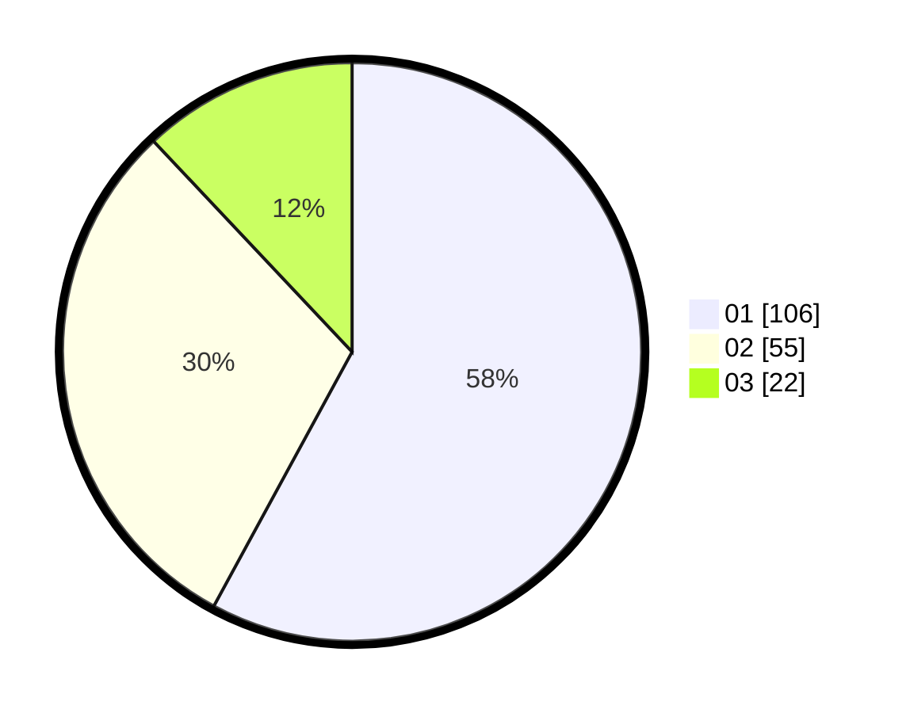

# Hasil

Hasil perolehan suara paslon dapat dilihat pada file paslon-01.txt, paslon-02.txt, dan paslon-03.txt.

Jika tidak ada, artinya data tersebut belum ada pada SIREKAP.

## Perolehan Suara

 * Paslon 01: **106**.
 * Paslon 02: **55**.
 * Paslon 03: **22**.

## Foto C Plano

https://sirekap-obj-formc.kpu.go.id/c49f/pemilu/ppwp/31/74/06/10/03/3174061003161-20240214-223642--e82fe962-fce4-4c9e-a99e-1fb76f677592.jpg

https://sirekap-obj-formc.kpu.go.id/c49f/pemilu/ppwp/31/74/06/10/03/3174061003161-20240214-223646--5a62ab09-1433-4614-bb1e-1dae2ff265dd.jpg

https://sirekap-obj-formc.kpu.go.id/c49f/pemilu/ppwp/31/74/06/10/03/3174061003161-20240214-223648--d5ccfb7c-1deb-4c29-9d48-cb7f231a4123.jpg

## DATA PEMILIH TETAP

Jumlah pemilih dalam DPT: **227**.
 * L: **105**.
 * P: **122**.

## DATA PENGGUNA HAK PILIH

Jumlah pengguna hak pilih dalam DPT: **179**.
 * L: **79**.
 * P: **100**.

Jumlah pengguna hak pilih dalam DPTb: **1**.
 * L: **1**.
 * P: **0**.

Jumlah pengguna hak pilih dalam DPK: **3**.
 * L: **1**.
 * P: **2**.

Jumlah pengguna hak pilih: **183**.
 * L: **81**.
 * P: **102**.

## JUMLAH SUARA SAH DAN TIDAK SAH

JUMLAH SELURUH SUARA SAH: **183**.

JUMLAH SUARA TIDAK SAH: **0**.

JUMLAH SELURUH SUARA SAH DAN SUARA TIDAK SAH: **183**.
