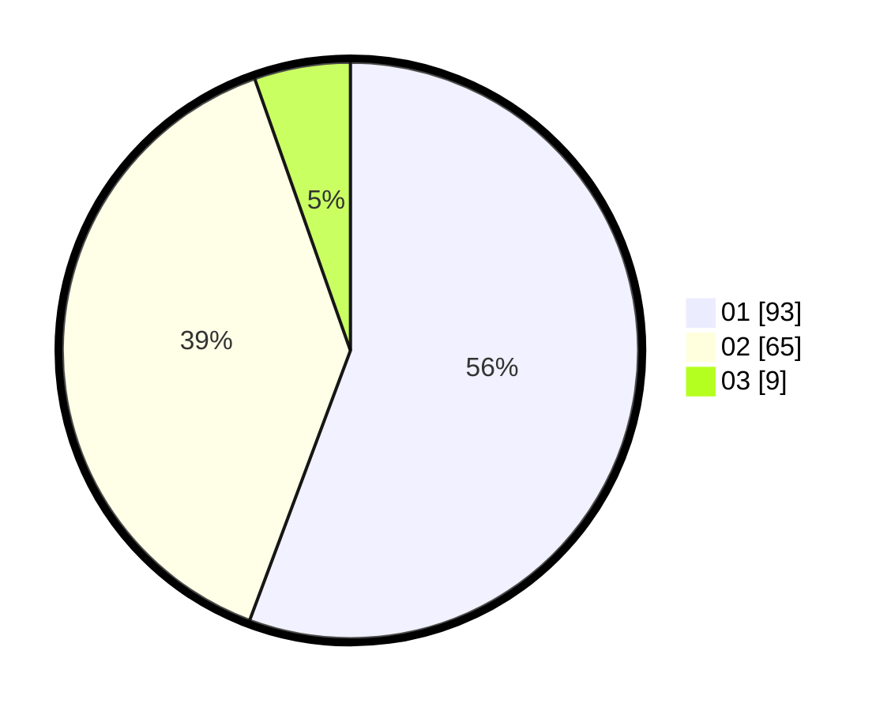

# Hasil

Hasil perolehan suara paslon dapat dilihat pada file paslon-01.txt, paslon-02.txt, dan paslon-03.txt.

Jika tidak ada, artinya data tersebut belum ada pada SIREKAP.

## Perolehan Suara

 * Paslon 01: **93**.
 * Paslon 02: **65**.
 * Paslon 03: **9**.

## Foto C Plano

https://sirekap-obj-formc.kpu.go.id/735e/pemilu/ppwp/31/74/06/10/03/3174061003168-20240216-101202--880cd564-386b-4382-8d58-0e47cde1a5a6.jpg

https://sirekap-obj-formc.kpu.go.id/735e/pemilu/ppwp/31/74/06/10/03/3174061003168-20240216-101203--fed5fe42-f6ee-4b05-b7e6-d098abe3d53f.jpg

https://sirekap-obj-formc.kpu.go.id/735e/pemilu/ppwp/31/74/06/10/03/3174061003168-20240216-101202--a3fc3deb-018e-49c4-a5a0-23a2246927ac.jpg

## DATA PEMILIH TETAP

Jumlah pemilih dalam DPT: **207**.
 * L: **103**.
 * P: **104**.

## DATA PENGGUNA HAK PILIH

Jumlah pengguna hak pilih dalam DPT: **170**.
 * L: **84**.
 * P: **86**.

Jumlah pengguna hak pilih dalam DPTb: **1**.
 * L: **0**.
 * P: **1**.

Jumlah pengguna hak pilih dalam DPK: **2**.
 * L: **1**.
 * P: **1**.

Jumlah pengguna hak pilih: **173**.
 * L: **85**.
 * P: **88**.

## JUMLAH SUARA SAH DAN TIDAK SAH

JUMLAH SELURUH SUARA SAH: **167**.

JUMLAH SUARA TIDAK SAH: **6**.

JUMLAH SELURUH SUARA SAH DAN SUARA TIDAK SAH: **173**.
