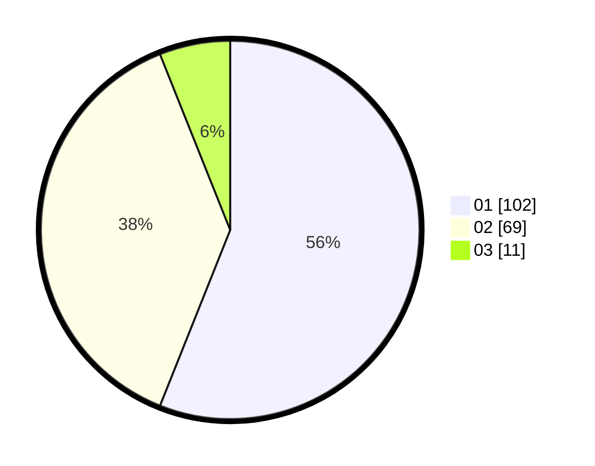

# Hasil

Hasil perolehan suara paslon dapat dilihat pada file paslon-01.txt, paslon-02.txt, dan paslon-03.txt.

Jika tidak ada, artinya data tersebut belum ada pada SIREKAP.

## Perolehan Suara

 * Paslon 01: **102**.
 * Paslon 02: **69**.
 * Paslon 03: **11**.

## Foto C Plano

https://sirekap-obj-formc.kpu.go.id/7995/pemilu/ppwp/31/74/06/10/03/3174061003169-20240214-230308--cc490872-d52a-49bf-a386-3b5c0362b294.jpg

https://sirekap-obj-formc.kpu.go.id/7995/pemilu/ppwp/31/74/06/10/03/3174061003169-20240214-233017--bd3a2b9e-230b-4720-b725-1029579c4ab6.jpg

https://sirekap-obj-formc.kpu.go.id/7995/pemilu/ppwp/31/74/06/10/03/3174061003169-20240214-233100--6d7f8134-6aff-4690-aa5f-a1d941282f6d.jpg
