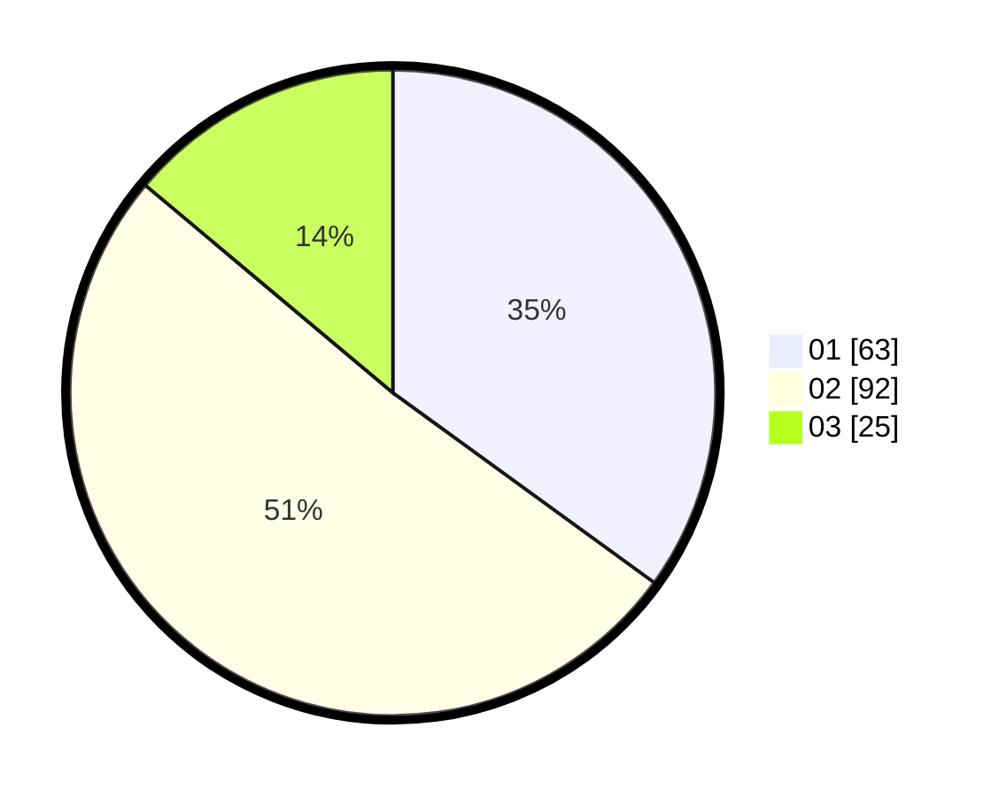

# Hasil

Hasil perolehan suara paslon dapat dilihat pada file paslon-01.txt, paslon-02.txt, dan paslon-03.txt.

Jika tidak ada, artinya data tersebut belum ada pada SIREKAP.

## Perolehan Suara

 * Paslon 01: **63**.
 * Paslon 02: **92**.
 * Paslon 03: **25**.

## Foto C Plano

https://sirekap-obj-formc.kpu.go.id/a752/pemilu/ppwp/31/74/06/10/04/3174061004004-20240216-052517--5a14069c-c33b-4987-b6f1-e21ea4ebb840.jpg

https://sirekap-obj-formc.kpu.go.id/a752/pemilu/ppwp/31/74/06/10/04/3174061004004-20240216-054226--73e1b7ba-d03b-4d33-a6c7-88f3ab157af4.jpg

https://sirekap-obj-formc.kpu.go.id/a752/pemilu/ppwp/31/74/06/10/04/3174061004004-20240216-052525--6b98808f-cf5f-4b34-a431-56e136f7bdd1.jpg

## DATA PEMILIH TETAP

Jumlah pemilih dalam DPT: **215**.
 * L: **113**.
 * P: **102**.

## DATA PENGGUNA HAK PILIH

Jumlah pengguna hak pilih dalam DPT: **172**.
 * L: **90**.
 * P: **82**.

Jumlah pengguna hak pilih dalam DPTb: **8**.
 * L: **6**.
 * P: **2**.

Jumlah pengguna hak pilih dalam DPK: **3**.
 * L: **1**.
 * P: **2**.

Jumlah pengguna hak pilih: **183**.
 * L: **97**.
 * P: **86**.

## JUMLAH SUARA SAH DAN TIDAK SAH

JUMLAH SELURUH SUARA SAH: **180**.

JUMLAH SUARA TIDAK SAH: **3**.

JUMLAH SELURUH SUARA SAH DAN SUARA TIDAK SAH: **183**.
