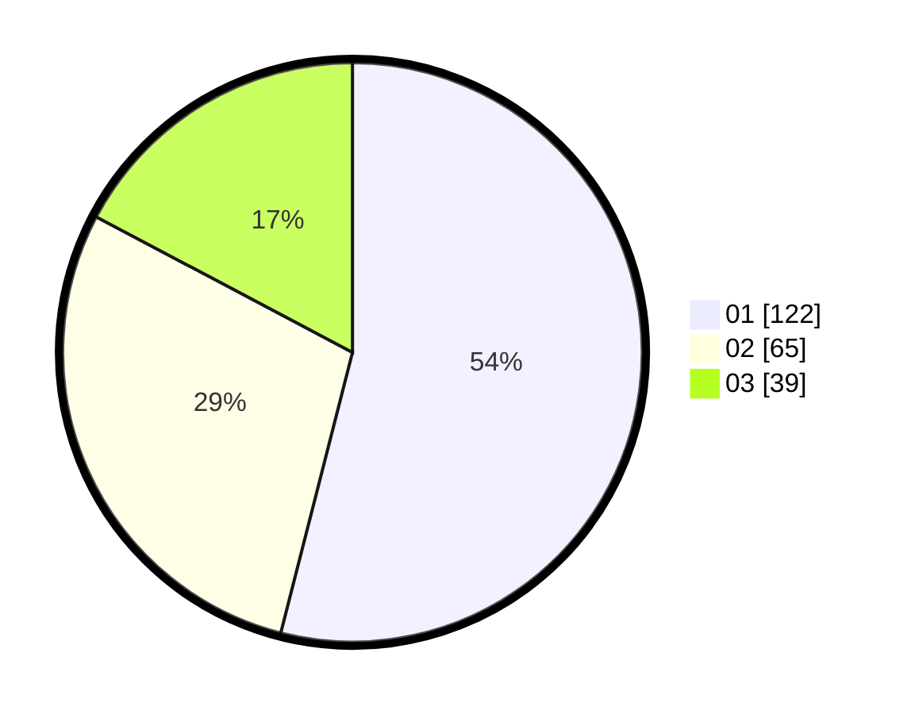

# Hasil

Hasil perolehan suara paslon dapat dilihat pada file paslon-01.txt, paslon-02.txt, dan paslon-03.txt.

Jika tidak ada, artinya data tersebut belum ada pada SIREKAP.

## Perolehan Suara

 * Paslon 01: **122**.
 * Paslon 02: **65**.
 * Paslon 03: **39**.

## Foto C Plano

https://sirekap-obj-formc.kpu.go.id/0115/pemilu/ppwp/31/74/06/10/04/3174061004040-20240216-133309--a33588bc-f8d9-4382-bce1-81f159895507.jpg

https://sirekap-obj-formc.kpu.go.id/0115/pemilu/ppwp/31/74/06/10/04/3174061004040-20240216-133310--3360c07a-e025-4f46-858f-65aee07718c9.jpg

https://sirekap-obj-formc.kpu.go.id/0115/pemilu/ppwp/31/74/06/10/04/3174061004040-20240216-133310--2e0665d4-df83-4ec1-9b52-ccbbc9d324be.jpg

## DATA PEMILIH TETAP

Jumlah pemilih dalam DPT: **291**.
 * L: **141**.
 * P: **150**.

## DATA PENGGUNA HAK PILIH

Jumlah pengguna hak pilih dalam DPT: **229**.
 * L: **107**.
 * P: **122**.

Jumlah pengguna hak pilih dalam DPTb: **3**.
 * L: **1**.
 * P: **2**.

Jumlah pengguna hak pilih dalam DPK: **1**.
 * L: **0**.
 * P: **1**.

Jumlah pengguna hak pilih: **233**.
 * L: **108**.
 * P: **125**.

## JUMLAH SUARA SAH DAN TIDAK SAH

JUMLAH SELURUH SUARA SAH: **226**.

JUMLAH SUARA TIDAK SAH: **7**.

JUMLAH SELURUH SUARA SAH DAN SUARA TIDAK SAH: **233**.
