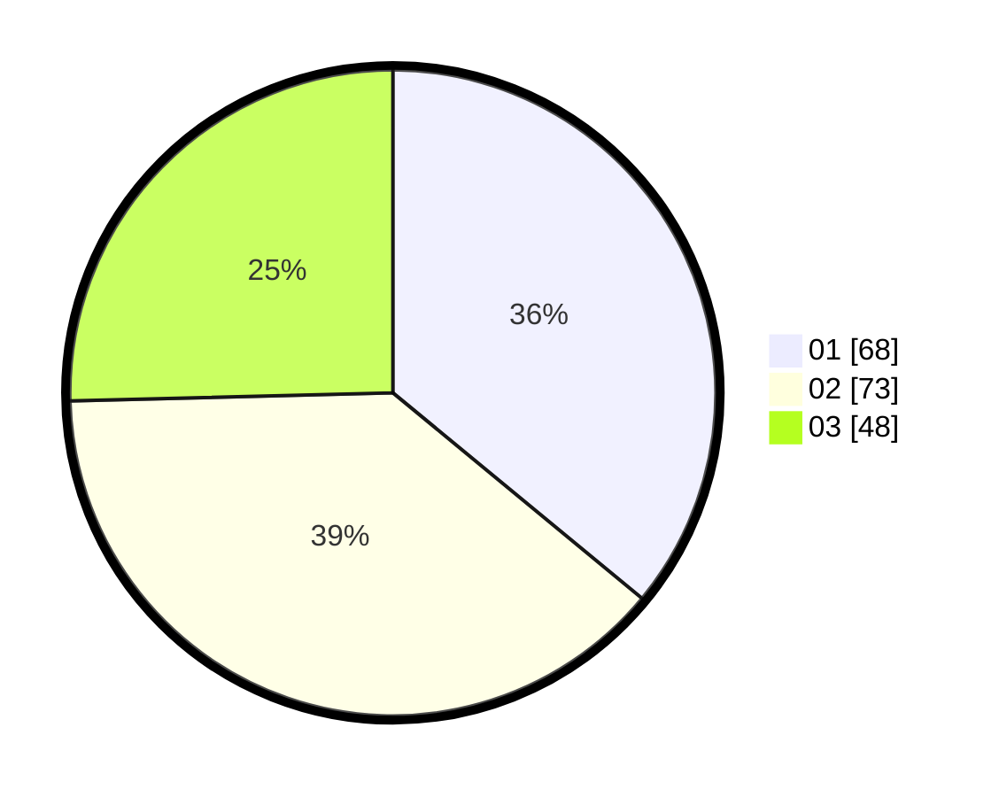

# Hasil

Hasil perolehan suara paslon dapat dilihat pada file paslon-01.txt, paslon-02.txt, dan paslon-03.txt.

Jika tidak ada, artinya data tersebut belum ada pada SIREKAP.

## Perolehan Suara

 * Paslon 01: **68**.
 * Paslon 02: **73**.
 * Paslon 03: **48**.

## Foto C Plano

https://sirekap-obj-formc.kpu.go.id/1d93/pemilu/ppwp/31/74/06/10/04/3174061004042-20240218-175428--aa206dd0-8b35-4e87-84a4-c66e842490a1.jpg

https://sirekap-obj-formc.kpu.go.id/1d93/pemilu/ppwp/31/74/06/10/04/3174061004042-20240218-175430--55cacc20-8dd6-47c0-90ce-a903c03667b4.jpg

https://sirekap-obj-formc.kpu.go.id/1d93/pemilu/ppwp/31/74/06/10/04/3174061004042-20240218-175429--7683499d-345c-4258-be9d-d8af3ee396b1.jpg

## DATA PEMILIH TETAP

Jumlah pemilih dalam DPT: **215**.
 * L: **105**.
 * P: **110**.

## DATA PENGGUNA HAK PILIH

Jumlah pengguna hak pilih dalam DPT: **176**.
 * L: **84**.
 * P: **92**.

Jumlah pengguna hak pilih dalam DPTb: **12**.
 * L: **6**.
 * P: **6**.

Jumlah pengguna hak pilih dalam DPK: **2**.
 * L: **0**.
 * P: **2**.

Jumlah pengguna hak pilih: **190**.
 * L: **90**.
 * P: **100**.

## JUMLAH SUARA SAH DAN TIDAK SAH

JUMLAH SELURUH SUARA SAH: **189**.

JUMLAH SUARA TIDAK SAH: **1**.

JUMLAH SELURUH SUARA SAH DAN SUARA TIDAK SAH: **190**.
