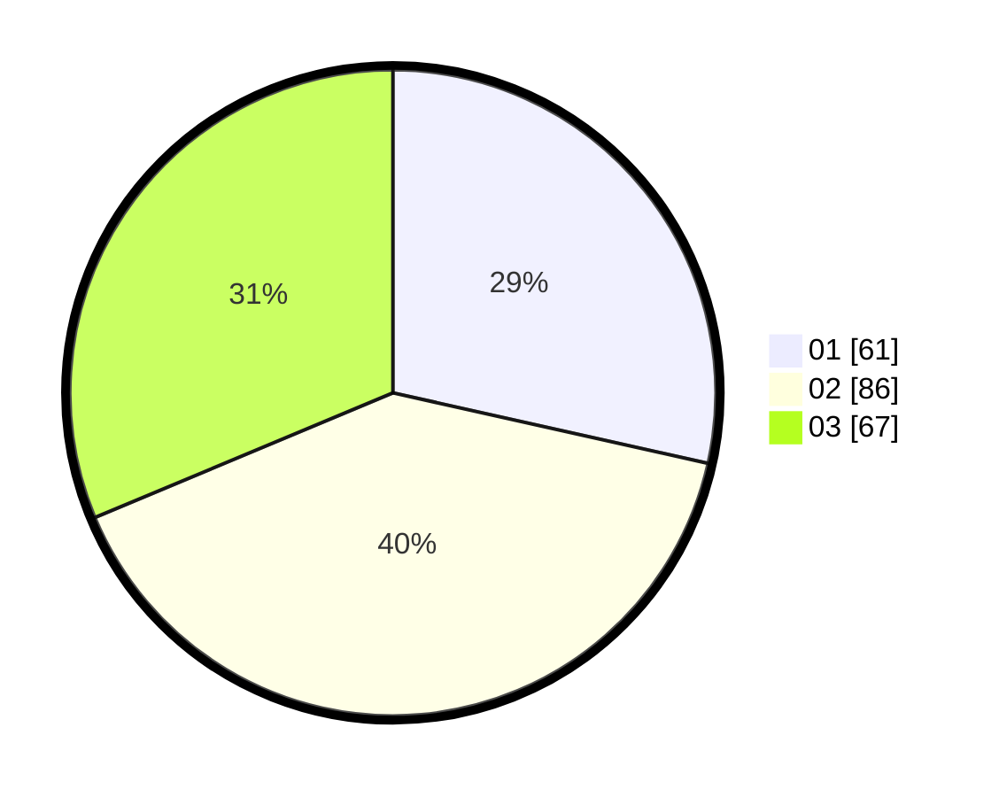

# Hasil

Hasil perolehan suara paslon dapat dilihat pada file paslon-01.txt, paslon-02.txt, dan paslon-03.txt.

Jika tidak ada, artinya data tersebut belum ada pada SIREKAP.

## Perolehan Suara

 * Paslon 01: **61**.
 * Paslon 02: **86**.
 * Paslon 03: **67**.

## Foto C Plano

https://sirekap-obj-formc.kpu.go.id/c724/pemilu/ppwp/31/74/06/10/05/3174061005001-20240216-145733--278b2901-b3bf-4511-9159-3b154416bbfc.jpg

https://sirekap-obj-formc.kpu.go.id/c724/pemilu/ppwp/31/74/06/10/05/3174061005001-20240216-150938--c6ff1545-f524-4b23-b043-2483ba815967.jpg

https://sirekap-obj-formc.kpu.go.id/c724/pemilu/ppwp/31/74/06/10/05/3174061005001-20240216-151821--22bddfd8-04c9-41eb-b77d-bff5710f22a6.jpg
