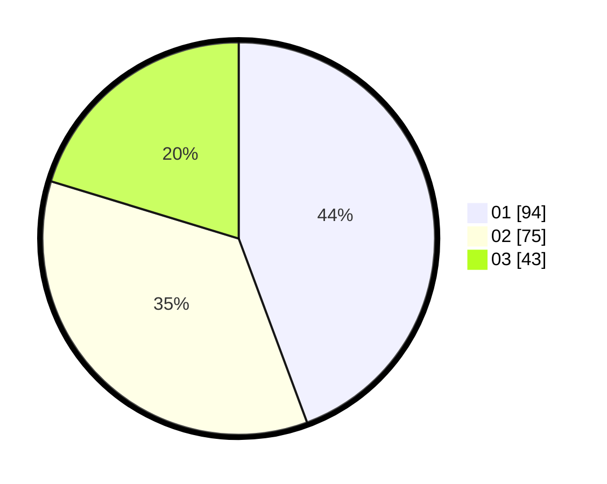

# Hasil

Hasil perolehan suara paslon dapat dilihat pada file paslon-01.txt, paslon-02.txt, dan paslon-03.txt.

Jika tidak ada, artinya data tersebut belum ada pada SIREKAP.

## Perolehan Suara

 * Paslon 01: **94**.
 * Paslon 02: **75**.
 * Paslon 03: **43**.

## Foto C Plano

https://sirekap-obj-formc.kpu.go.id/69b6/pemilu/ppwp/31/74/06/10/05/3174061005004-20240216-163028--67d164bf-bc47-408d-a07b-6cd8bb532be9.jpg

https://sirekap-obj-formc.kpu.go.id/69b6/pemilu/ppwp/31/74/06/10/05/3174061005004-20240216-163059--e88c96a2-fd89-4e44-b24f-9cf104a19415.jpg

https://sirekap-obj-formc.kpu.go.id/69b6/pemilu/ppwp/31/74/06/10/05/3174061005004-20240216-163202--d426b75b-1e31-4d08-b8c8-196f7322977f.jpg
