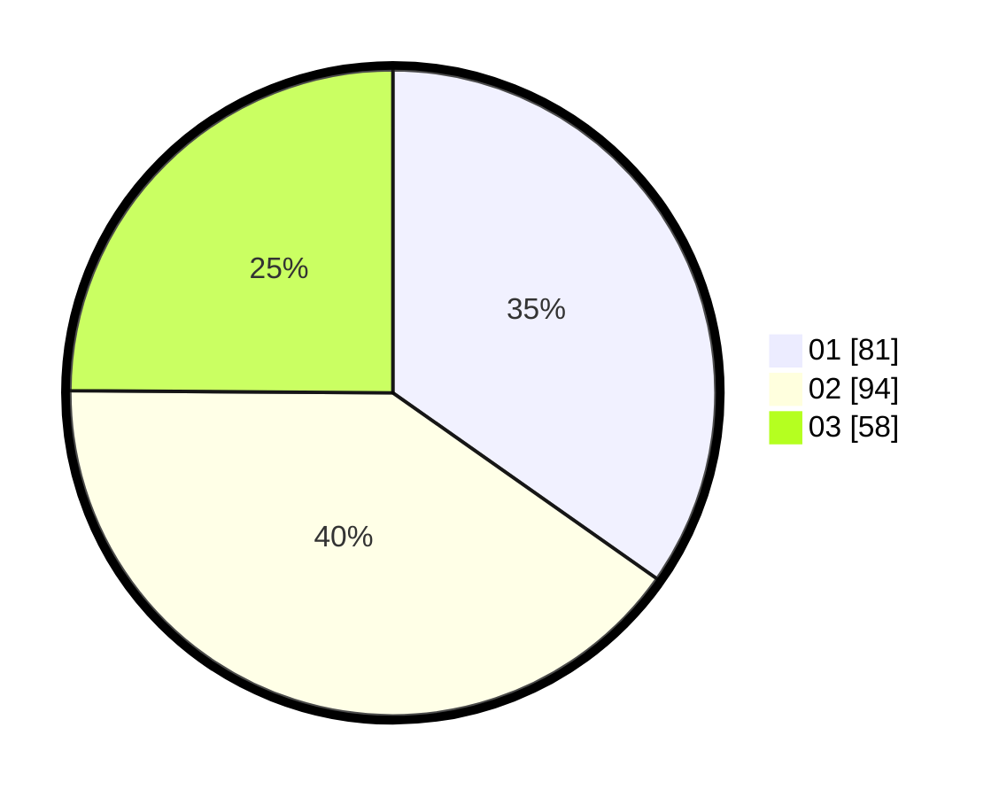

# Hasil

Hasil perolehan suara paslon dapat dilihat pada file paslon-01.txt, paslon-02.txt, dan paslon-03.txt.

Jika tidak ada, artinya data tersebut belum ada pada SIREKAP.

## Perolehan Suara

 * Paslon 01: **81**.
 * Paslon 02: **94**.
 * Paslon 03: **58**.

## Foto C Plano

https://sirekap-obj-formc.kpu.go.id/f676/pemilu/ppwp/31/74/06/10/05/3174061005005-20240216-163504--0f4ae447-3c2f-493d-b733-5e149b86b235.jpg

https://sirekap-obj-formc.kpu.go.id/f676/pemilu/ppwp/31/74/06/10/05/3174061005005-20240216-163520--9c395c88-aa83-4c0d-a2cc-1dc009e89910.jpg

https://sirekap-obj-formc.kpu.go.id/f676/pemilu/ppwp/31/74/06/10/05/3174061005005-20240216-163537--303aff83-e306-403a-9850-bdfb881a2175.jpg
