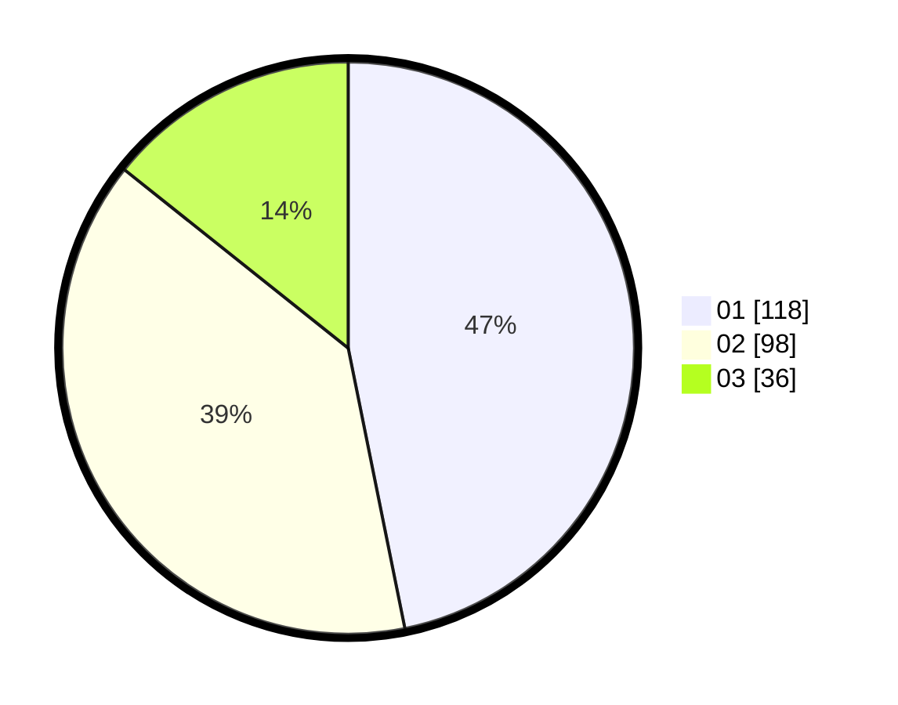

# Hasil

Hasil perolehan suara paslon dapat dilihat pada file paslon-01.txt, paslon-02.txt, dan paslon-03.txt.

Jika tidak ada, artinya data tersebut belum ada pada SIREKAP.

## Perolehan Suara

 * Paslon 01: **118**.
 * Paslon 02: **98**.
 * Paslon 03: **36**.

## Foto C Plano

https://sirekap-obj-formc.kpu.go.id/3d12/pemilu/ppwp/31/74/06/10/05/3174061005009-20240216-165831--ea3b11d0-2e41-49fc-a509-2698d99a4e2c.jpg

https://sirekap-obj-formc.kpu.go.id/3d12/pemilu/ppwp/31/74/06/10/05/3174061005009-20240216-165919--35e4b6ac-e023-47b3-9b04-34c76fc64d64.jpg

https://sirekap-obj-formc.kpu.go.id/3d12/pemilu/ppwp/31/74/06/10/05/3174061005009-20240216-170001--1bb2d64b-7086-434f-8088-4626e41aebf8.jpg
