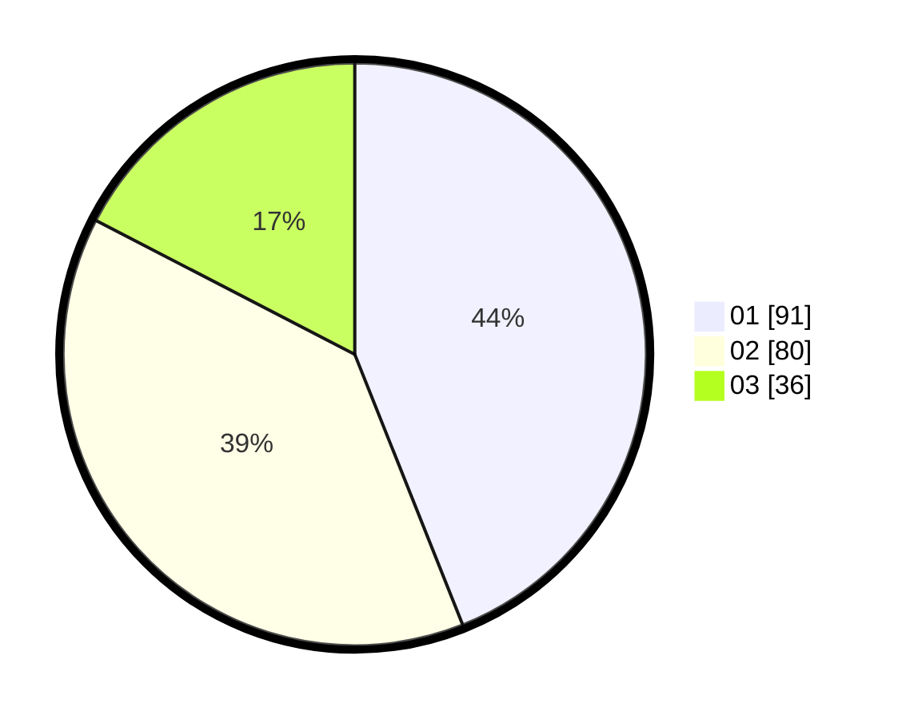

# Hasil

Hasil perolehan suara paslon dapat dilihat pada file paslon-01.txt, paslon-02.txt, dan paslon-03.txt.

Jika tidak ada, artinya data tersebut belum ada pada SIREKAP.

## Perolehan Suara

 * Paslon 01: **91**.
 * Paslon 02: **80**.
 * Paslon 03: **36**.

## Foto C Plano

https://sirekap-obj-formc.kpu.go.id/2d05/pemilu/ppwp/31/74/06/10/05/3174061005010-20240216-170452--1851f9c2-bbe3-4d85-9d53-80af50488dba.jpg

https://sirekap-obj-formc.kpu.go.id/2d05/pemilu/ppwp/31/74/06/10/05/3174061005010-20240216-170529--0e6deca8-a5ac-4897-ac6e-58025cbf57bb.jpg

https://sirekap-obj-formc.kpu.go.id/2d05/pemilu/ppwp/31/74/06/10/05/3174061005010-20240216-170602--6a18a6fe-f4ae-4dd1-b680-8656ac7bc36b.jpg
