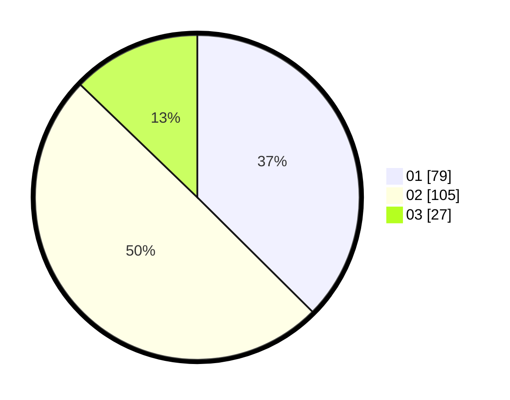

# Hasil

Hasil perolehan suara paslon dapat dilihat pada file paslon-01.txt, paslon-02.txt, dan paslon-03.txt.

Jika tidak ada, artinya data tersebut belum ada pada SIREKAP.

## Perolehan Suara

 * Paslon 01: **79**.
 * Paslon 02: **105**.
 * Paslon 03: **27**.

## Foto C Plano

https://sirekap-obj-formc.kpu.go.id/93c5/pemilu/ppwp/31/74/06/10/05/3174061005012-20240214-155020--c8ed3fed-5525-445a-b061-665f43948c2e.jpg

https://sirekap-obj-formc.kpu.go.id/93c5/pemilu/ppwp/31/74/06/10/05/3174061005012-20240214-155442--175962a9-977c-4b16-9a52-5fa4e557ba35.jpg

https://sirekap-obj-formc.kpu.go.id/93c5/pemilu/ppwp/31/74/06/10/05/3174061005012-20240214-155625--98e43c8f-cf96-4070-9b1b-23da3473cbe9.jpg

## DATA PEMILIH TETAP

Jumlah pemilih dalam DPT: **272**.
 * L: **133**.
 * P: **139**.

## DATA PENGGUNA HAK PILIH

Jumlah pengguna hak pilih dalam DPT: **212**.
 * L: **98**.
 * P: **114**.

Jumlah pengguna hak pilih dalam DPTb: **1**.
 * L: **0**.
 * P: **1**.

Jumlah pengguna hak pilih dalam DPK: **0**.
 * L: **0**.
 * P: **0**.

Jumlah pengguna hak pilih: **213**.
 * L: **98**.
 * P: **116**.

## JUMLAH SUARA SAH DAN TIDAK SAH

JUMLAH SELURUH SUARA SAH: **211**.

JUMLAH SUARA TIDAK SAH: **2**.

JUMLAH SELURUH SUARA SAH DAN SUARA TIDAK SAH: **213**.
