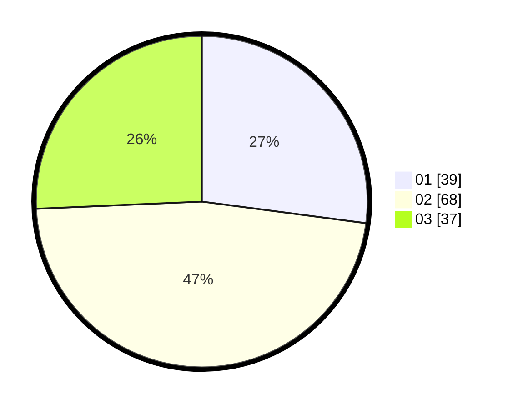

# Hasil

Hasil perolehan suara paslon dapat dilihat pada file paslon-01.txt, paslon-02.txt, dan paslon-03.txt.

Jika tidak ada, artinya data tersebut belum ada pada SIREKAP.

## Perolehan Suara

 * Paslon 01: **39**.
 * Paslon 02: **68**.
 * Paslon 03: **37**.

## Foto C Plano

https://sirekap-obj-formc.kpu.go.id/2434/pemilu/ppwp/31/74/06/10/05/3174061005088-20240215-204650--8548f9d8-ccff-423b-8010-05b7fcd8f501.jpg

https://sirekap-obj-formc.kpu.go.id/2434/pemilu/ppwp/31/74/06/10/05/3174061005088-20240215-204651--fed5b850-8cdf-41e5-a196-d5d2584b7af2.jpg

https://sirekap-obj-formc.kpu.go.id/2434/pemilu/ppwp/31/74/06/10/05/3174061005088-20240215-204650--1a0ecb61-0423-49e5-a532-9df65939c4a9.jpg

## DATA PEMILIH TETAP

Jumlah pemilih dalam DPT: **173**.
 * L: **80**.
 * P: **93**.

## DATA PENGGUNA HAK PILIH

Jumlah pengguna hak pilih dalam DPT: **124**.
 * L: **64**.
 * P: **60**.

Jumlah pengguna hak pilih dalam DPTb: **13**.
 * L: **8**.
 * P: **5**.

Jumlah pengguna hak pilih dalam DPK: **7**.
 * L: **4**.
 * P: **3**.

Jumlah pengguna hak pilih: **144**.
 * L: **76**.
 * P: **68**.

## JUMLAH SUARA SAH DAN TIDAK SAH

JUMLAH SELURUH SUARA SAH: **144**.

JUMLAH SUARA TIDAK SAH: **1**.

JUMLAH SELURUH SUARA SAH DAN SUARA TIDAK SAH: **145**.
