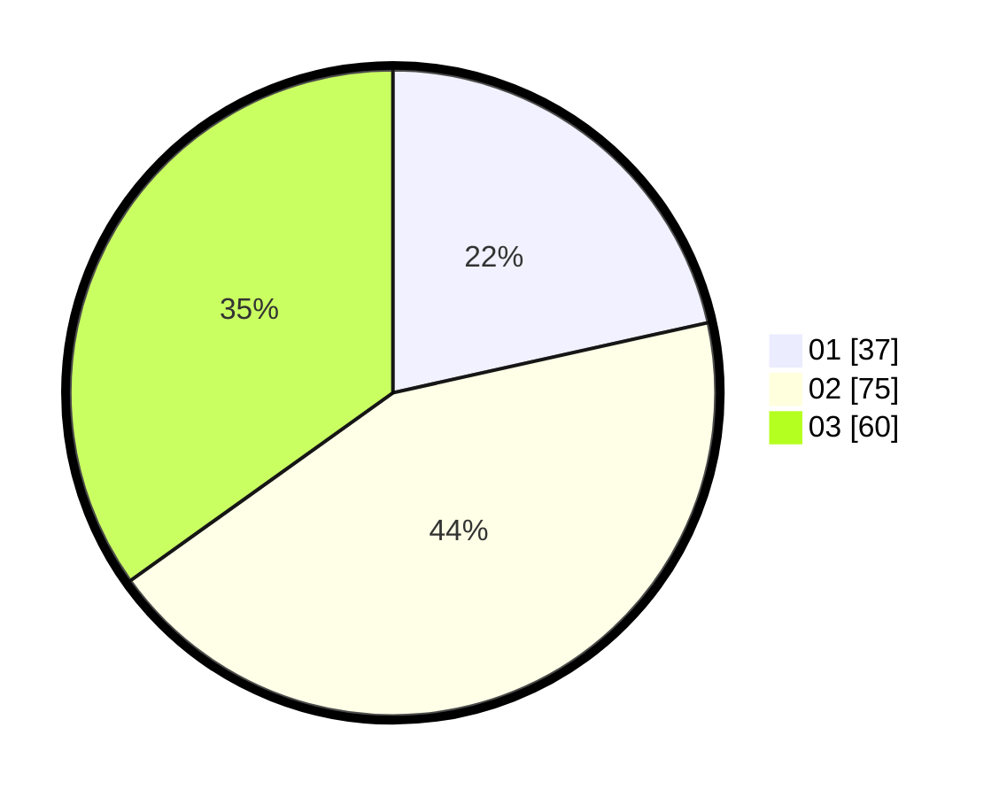

# Hasil

Hasil perolehan suara paslon dapat dilihat pada file paslon-01.txt, paslon-02.txt, dan paslon-03.txt.

Jika tidak ada, artinya data tersebut belum ada pada SIREKAP.

## Perolehan Suara

 * Paslon 01: **37**.
 * Paslon 02: **75**.
 * Paslon 03: **60**.

## Foto C Plano

https://sirekap-obj-formc.kpu.go.id/f49d/pemilu/ppwp/31/74/07/10/01/3174071001004-20240214-184451--a0d96643-81c6-46e8-a7fd-1e463263ca51.jpg

https://sirekap-obj-formc.kpu.go.id/f49d/pemilu/ppwp/31/74/07/10/01/3174071001004-20240214-184454--fea9994b-eeec-4a82-ab1d-724cc03b1a5b.jpg

https://sirekap-obj-formc.kpu.go.id/f49d/pemilu/ppwp/31/74/07/10/01/3174071001004-20240214-184456--97c9a588-110e-4fc1-b264-e96ebeecb2b3.jpg

## DATA PEMILIH TETAP

Jumlah pemilih dalam DPT: **210**.
 * L: **99**.
 * P: **111**.

## DATA PENGGUNA HAK PILIH

Jumlah pengguna hak pilih dalam DPT: **150**.
 * L: **70**.
 * P: **80**.

Jumlah pengguna hak pilih dalam DPTb: **20**.
 * L: **6**.
 * P: **14**.

Jumlah pengguna hak pilih dalam DPK: **5**.
 * L: **4**.
 * P: **1**.

Jumlah pengguna hak pilih: **175**.
 * L: **80**.
 * P: **95**.

## JUMLAH SUARA SAH DAN TIDAK SAH

JUMLAH SELURUH SUARA SAH: **172**.

JUMLAH SUARA TIDAK SAH: **3**.

JUMLAH SELURUH SUARA SAH DAN SUARA TIDAK SAH: **175**.
