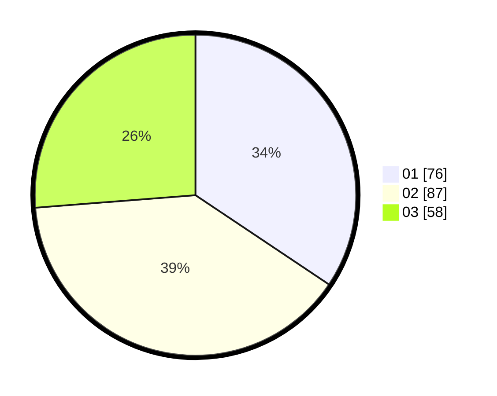

# Hasil

Hasil perolehan suara paslon dapat dilihat pada file paslon-01.txt, paslon-02.txt, dan paslon-03.txt.

Jika tidak ada, artinya data tersebut belum ada pada SIREKAP.

## Perolehan Suara

 * Paslon 01: **76**.
 * Paslon 02: **87**.
 * Paslon 03: **58**.

## Foto C Plano

https://sirekap-obj-formc.kpu.go.id/88d8/pemilu/ppwp/31/74/07/10/02/3174071002031-20240214-190036--f2f4a3d6-64be-441f-9187-c0308f680241.jpg

https://sirekap-obj-formc.kpu.go.id/88d8/pemilu/ppwp/31/74/07/10/02/3174071002031-20240214-190514--4c0baaf3-5f2f-4d1e-a94b-e064833281a2.jpg

https://sirekap-obj-formc.kpu.go.id/88d8/pemilu/ppwp/31/74/07/10/02/3174071002031-20240214-190600--21c99c0e-38d7-4038-abf4-c20defa270b8.jpg

## DATA PEMILIH TETAP

Jumlah pemilih dalam DPT: **275**.
 * L: **134**.
 * P: **141**.

## DATA PENGGUNA HAK PILIH

Jumlah pengguna hak pilih dalam DPT: **206**.
 * L: **83**.
 * P: **123**.

Jumlah pengguna hak pilih dalam DPTb: **15**.
 * L: **7**.
 * P: **8**.

Jumlah pengguna hak pilih dalam DPK: **4**.
 * L: **2**.
 * P: **2**.

Jumlah pengguna hak pilih: **225**.
 * L: **92**.
 * P: **133**.

## JUMLAH SUARA SAH DAN TIDAK SAH

JUMLAH SELURUH SUARA SAH: **221**.

JUMLAH SUARA TIDAK SAH: **4**.

JUMLAH SELURUH SUARA SAH DAN SUARA TIDAK SAH: **225**.
