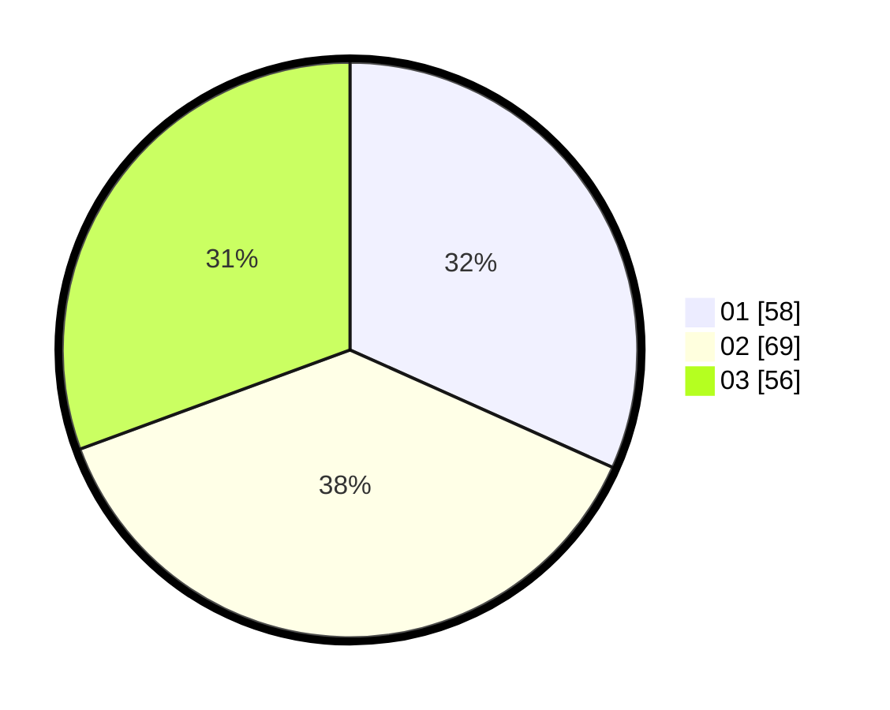

# Hasil

Hasil perolehan suara paslon dapat dilihat pada file paslon-01.txt, paslon-02.txt, dan paslon-03.txt.

Jika tidak ada, artinya data tersebut belum ada pada SIREKAP.

## Perolehan Suara

 * Paslon 01: **58**.
 * Paslon 02: **69**.
 * Paslon 03: **56**.

## Foto C Plano

https://sirekap-obj-formc.kpu.go.id/1125/pemilu/ppwp/31/74/07/10/03/3174071003001-20240214-200100--ced876e2-0d5c-43f3-b9b4-7baad922c683.jpg

https://sirekap-obj-formc.kpu.go.id/1125/pemilu/ppwp/31/74/07/10/03/3174071003001-20240214-200210--e9a40ea3-1e7a-424c-acca-3c61113c055e.jpg

https://sirekap-obj-formc.kpu.go.id/1125/pemilu/ppwp/31/74/07/10/03/3174071003001-20240214-200252--8b45ac09-d26f-4ee3-b940-df2ce79b89c8.jpg

## DATA PEMILIH TETAP

Jumlah pemilih dalam DPT: **223**.
 * L: **111**.
 * P: **112**.

## DATA PENGGUNA HAK PILIH

Jumlah pengguna hak pilih dalam DPT: **159**.
 * L: **75**.
 * P: **84**.

Jumlah pengguna hak pilih dalam DPTb: **23**.
 * L: **8**.
 * P: **15**.

Jumlah pengguna hak pilih dalam DPK: **1**.
 * L: **0**.
 * P: **1**.

Jumlah pengguna hak pilih: **183**.
 * L: **83**.
 * P: **100**.

## JUMLAH SUARA SAH DAN TIDAK SAH

JUMLAH SELURUH SUARA SAH: **183**.

JUMLAH SUARA TIDAK SAH: **0**.

JUMLAH SELURUH SUARA SAH DAN SUARA TIDAK SAH: **183**.
