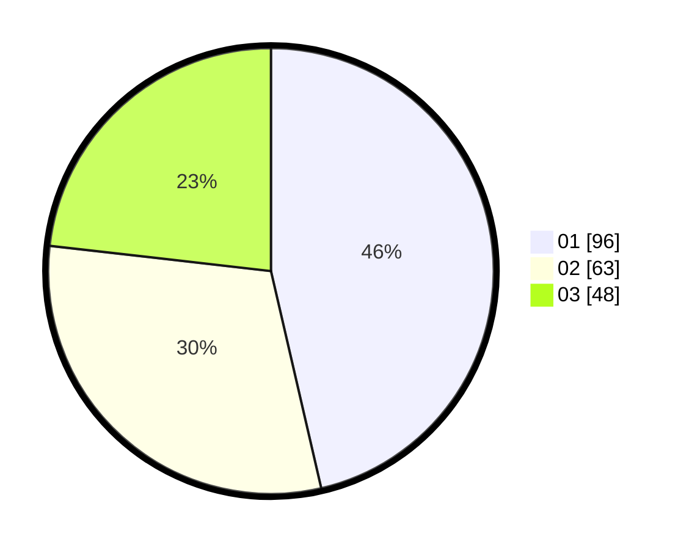

# Hasil

Hasil perolehan suara paslon dapat dilihat pada file paslon-01.txt, paslon-02.txt, dan paslon-03.txt.

Jika tidak ada, artinya data tersebut belum ada pada SIREKAP.

## Perolehan Suara

 * Paslon 01: **96**.
 * Paslon 02: **63**.
 * Paslon 03: **48**.

## Foto C Plano

https://sirekap-obj-formc.kpu.go.id/626d/pemilu/ppwp/31/74/07/10/03/3174071003003-20240217-145646--5f8dadc6-9adc-4969-8d17-8993aff1b0bb.jpg

https://sirekap-obj-formc.kpu.go.id/626d/pemilu/ppwp/31/74/07/10/03/3174071003003-20240217-145514--c05a8f99-8d84-4136-98e8-cd3e54c1acef.jpg

https://sirekap-obj-formc.kpu.go.id/626d/pemilu/ppwp/31/74/07/10/03/3174071003003-20240217-145726--33ccf046-dd63-4b0e-b891-fbfdc1b01ec1.jpg

## DATA PEMILIH TETAP

Jumlah pemilih dalam DPT: **246**.
 * L: **113**.
 * P: **133**.

## DATA PENGGUNA HAK PILIH

Jumlah pengguna hak pilih dalam DPT: **192**.
 * L: **90**.
 * P: **102**.

Jumlah pengguna hak pilih dalam DPTb: **15**.
 * L: **7**.
 * P: **8**.

Jumlah pengguna hak pilih dalam DPK: **6**.
 * L: **5**.
 * P: **1**.

Jumlah pengguna hak pilih: **213**.
 * L: **102**.
 * P: **111**.

## JUMLAH SUARA SAH DAN TIDAK SAH

JUMLAH SELURUH SUARA SAH: **207**.

JUMLAH SUARA TIDAK SAH: **6**.

JUMLAH SELURUH SUARA SAH DAN SUARA TIDAK SAH: **213**.
