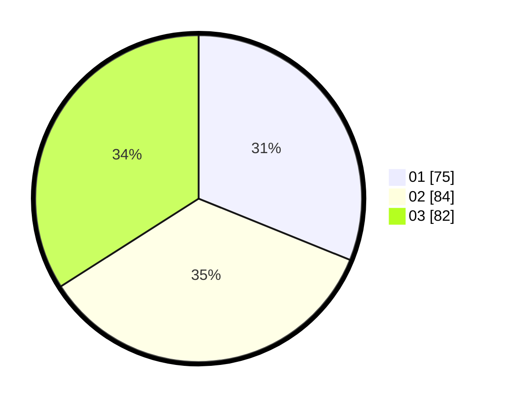

# Hasil

Hasil perolehan suara paslon dapat dilihat pada file paslon-01.txt, paslon-02.txt, dan paslon-03.txt.

Jika tidak ada, artinya data tersebut belum ada pada SIREKAP.

## Perolehan Suara

 * Paslon 01: **75**.
 * Paslon 02: **84**.
 * Paslon 03: **82**.

## Foto C Plano

https://sirekap-obj-formc.kpu.go.id/70ac/pemilu/ppwp/31/74/07/10/03/3174071003005-20240217-181304--913ee063-ebe7-4c57-97fd-64a56faf6239.jpg

https://sirekap-obj-formc.kpu.go.id/70ac/pemilu/ppwp/31/74/07/10/03/3174071003005-20240217-181601--dd2292c8-f46e-42b9-b013-566eef117bf7.jpg

https://sirekap-obj-formc.kpu.go.id/70ac/pemilu/ppwp/31/74/07/10/03/3174071003005-20240217-182930--1235642e-d7df-4974-9cc7-9797cde476bd.jpg

## DATA PEMILIH TETAP

Jumlah pemilih dalam DPT: **272**.
 * L: **136**.
 * P: **136**.

## DATA PENGGUNA HAK PILIH

Jumlah pengguna hak pilih dalam DPT: **505**.
 * L: **55**.
 * P: **55**.

Jumlah pengguna hak pilih dalam DPTb: **28**.
 * L: **9**.
 * P: **19**.

Jumlah pengguna hak pilih dalam DPK: **2**.
 * L: **0**.
 * P: **2**.

Jumlah pengguna hak pilih: **242**.
 * L: **114**.
 * P: **129**.

## JUMLAH SUARA SAH DAN TIDAK SAH

JUMLAH SELURUH SUARA SAH: **241**.

JUMLAH SUARA TIDAK SAH: **2**.

JUMLAH SELURUH SUARA SAH DAN SUARA TIDAK SAH: **243**.
