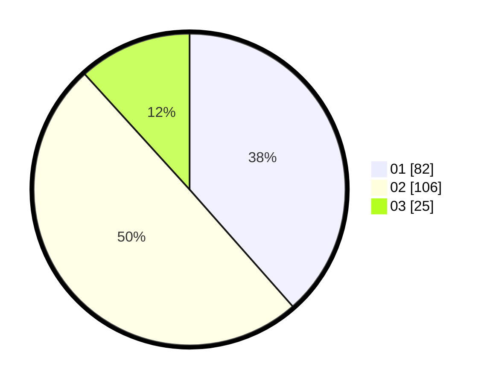

# Hasil

Hasil perolehan suara paslon dapat dilihat pada file paslon-01.txt, paslon-02.txt, dan paslon-03.txt.

Jika tidak ada, artinya data tersebut belum ada pada SIREKAP.

## Perolehan Suara

 * Paslon 01: **82**.
 * Paslon 02: **106**.
 * Paslon 03: **25**.

## Foto C Plano

https://sirekap-obj-formc.kpu.go.id/2cc1/pemilu/ppwp/31/74/07/10/03/3174071003006-20240218-135919--06e0ce99-f94b-4b19-b614-df1208d0c98d.jpg

https://sirekap-obj-formc.kpu.go.id/2cc1/pemilu/ppwp/31/74/07/10/03/3174071003006-20240218-140259--31c2e167-3113-48c6-837f-68e1dcf74cdc.jpg

https://sirekap-obj-formc.kpu.go.id/2cc1/pemilu/ppwp/31/74/07/10/03/3174071003006-20240218-141305--7e295ac6-6f54-4fde-87bc-b315e30bc322.jpg

## DATA PEMILIH TETAP

Jumlah pemilih dalam DPT: **243**.
 * L: **123**.
 * P: **120**.

## DATA PENGGUNA HAK PILIH

Jumlah pengguna hak pilih dalam DPT: **204**.
 * L: **106**.
 * P: **98**.

Jumlah pengguna hak pilih dalam DPTb: **12**.
 * L: **6**.
 * P: **6**.

Jumlah pengguna hak pilih dalam DPK: **1**.
 * L: **1**.
 * P: **0**.

Jumlah pengguna hak pilih: **217**.
 * L: **113**.
 * P: **104**.

## JUMLAH SUARA SAH DAN TIDAK SAH

JUMLAH SELURUH SUARA SAH: **213**.

JUMLAH SUARA TIDAK SAH: **4**.

JUMLAH SELURUH SUARA SAH DAN SUARA TIDAK SAH: **217**.
