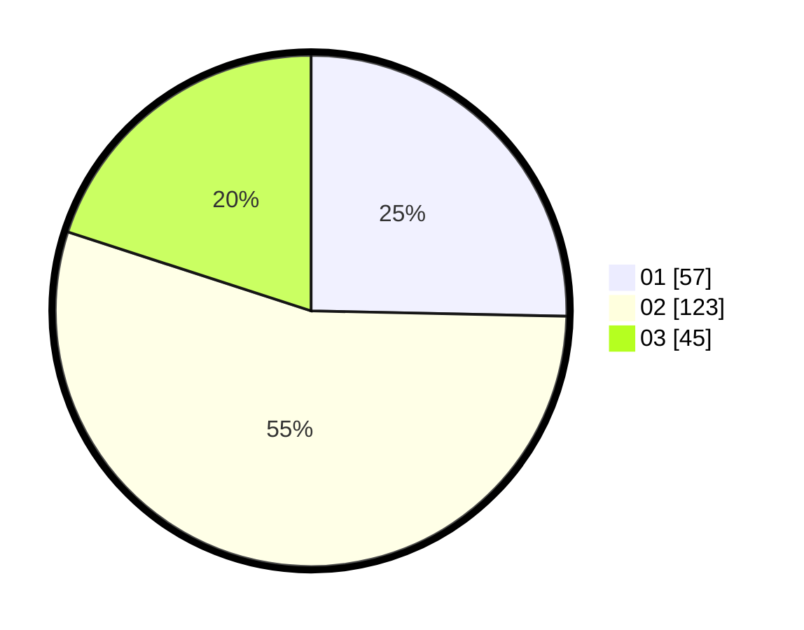

# Hasil

Hasil perolehan suara paslon dapat dilihat pada file paslon-01.txt, paslon-02.txt, dan paslon-03.txt.

Jika tidak ada, artinya data tersebut belum ada pada SIREKAP.

## Perolehan Suara

 * Paslon 01: **57**.
 * Paslon 02: **123**.
 * Paslon 03: **45**.

## Foto C Plano

https://sirekap-obj-formc.kpu.go.id/9960/pemilu/ppwp/31/74/07/10/03/3174071003009-20240216-010750--b8f9c219-4569-4755-b020-49987845dccf.jpg

https://sirekap-obj-formc.kpu.go.id/9960/pemilu/ppwp/31/74/07/10/03/3174071003009-20240214-155113--5c05521c-819d-40a6-a58c-535a57bedbea.jpg

https://sirekap-obj-formc.kpu.go.id/9960/pemilu/ppwp/31/74/07/10/03/3174071003009-20240214-155253--0ab68d44-c88a-4402-abe8-062d60c6ce86.jpg

## DATA PEMILIH TETAP

Jumlah pemilih dalam DPT: **291**.
 * L: **154**.
 * P: **137**.

## DATA PENGGUNA HAK PILIH

Jumlah pengguna hak pilih dalam DPT: **224**.
 * L: **118**.
 * P: **106**.

Jumlah pengguna hak pilih dalam DPTb: **4**.
 * L: **1**.
 * P: **3**.

Jumlah pengguna hak pilih dalam DPK: **3**.
 * L: **2**.
 * P: **1**.

Jumlah pengguna hak pilih: **231**.
 * L: **121**.
 * P: **110**.

## JUMLAH SUARA SAH DAN TIDAK SAH

JUMLAH SELURUH SUARA SAH: **225**.

JUMLAH SUARA TIDAK SAH: **6**.

JUMLAH SELURUH SUARA SAH DAN SUARA TIDAK SAH: **231**.
