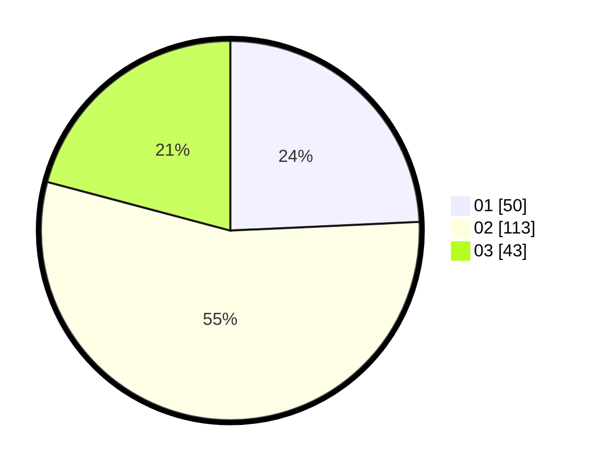

# Hasil

Hasil perolehan suara paslon dapat dilihat pada file paslon-01.txt, paslon-02.txt, dan paslon-03.txt.

Jika tidak ada, artinya data tersebut belum ada pada SIREKAP.

## Perolehan Suara

 * Paslon 01: **50**.
 * Paslon 02: **113**.
 * Paslon 03: **43**.

## Foto C Plano

https://sirekap-obj-formc.kpu.go.id/18d6/pemilu/ppwp/31/74/07/10/03/3174071003010-20240214-223332--454a244c-2a5f-4df7-8aa5-941f1ecd1b1d.jpg

https://sirekap-obj-formc.kpu.go.id/18d6/pemilu/ppwp/31/74/07/10/03/3174071003010-20240214-223413--e9ae4bbc-cbb9-47ed-b9ac-7b882cec8a6f.jpg
