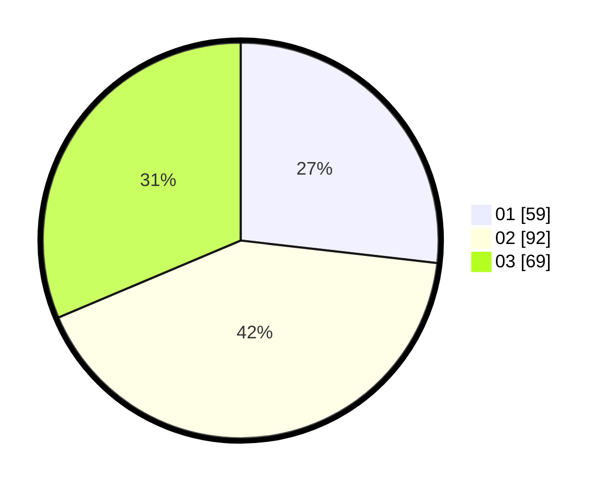

# Hasil

Hasil perolehan suara paslon dapat dilihat pada file paslon-01.txt, paslon-02.txt, dan paslon-03.txt.

Jika tidak ada, artinya data tersebut belum ada pada SIREKAP.

## Perolehan Suara

 * Paslon 01: **59**.
 * Paslon 02: **92**.
 * Paslon 03: **69**.

## Foto C Plano

https://sirekap-obj-formc.kpu.go.id/7b80/pemilu/ppwp/31/74/07/10/03/3174071003012-20240215-213955--eddef567-5a46-40c6-8cd3-78447beab4ce.jpg

https://sirekap-obj-formc.kpu.go.id/7b80/pemilu/ppwp/31/74/07/10/03/3174071003012-20240215-213959--b45907c9-0337-4008-9faa-494d5b57ded5.jpg

https://sirekap-obj-formc.kpu.go.id/7b80/pemilu/ppwp/31/74/07/10/03/3174071003012-20240215-213956--b62c4df0-7ecf-4e0e-a13c-d485ff8e1e63.jpg

## DATA PEMILIH TETAP

Jumlah pemilih dalam DPT: **244**.
 * L: **119**.
 * P: **125**.

## DATA PENGGUNA HAK PILIH

Jumlah pengguna hak pilih dalam DPT: **192**.
 * L: **102**.
 * P: **90**.

Jumlah pengguna hak pilih dalam DPTb: **28**.
 * L: **10**.
 * P: **18**.

Jumlah pengguna hak pilih dalam DPK: **6**.
 * L: **1**.
 * P: **5**.

Jumlah pengguna hak pilih: **226**.
 * L: **113**.
 * P: **113**.

## JUMLAH SUARA SAH DAN TIDAK SAH

JUMLAH SELURUH SUARA SAH: **220**.

JUMLAH SUARA TIDAK SAH: **6**.

JUMLAH SELURUH SUARA SAH DAN SUARA TIDAK SAH: **226**.
